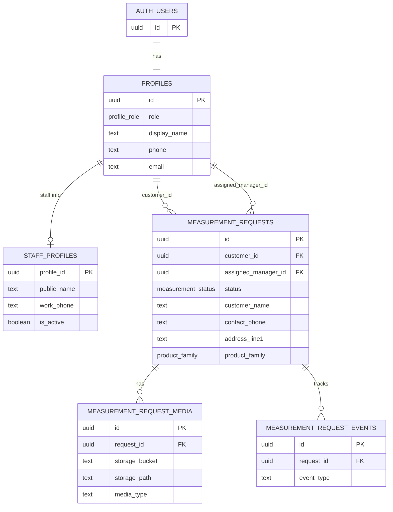

# 문장군 플랫폼 DB/RBAC 설계

## 0. 목적

이 문서는 플랫폼 전체 OS의 완성 설계가 아니다.

목적은 MVP-01 카카오 로그인과 MVP-02 무료방문견적 신청 + 어드민 접수 큐를 안전하게 구현할 만큼의 최소 DB/RBAC를 확정하는 것이다.

이번 설계가 통과되면 다음 순서로 바로 개발한다.

```text
1. 카카오 로그인
2. 무료방문견적 신청 + 어드민 접수 큐
3. 관리자/영업 매니저 접수 확인
4. 담당자 배정
```

견적, 결제, A/S, 시공 일정은 이번 문서에서 확장 여지만 남기고 구현 범위에서는 제외한다.

## 1. 기준 문서

우선순위는 다음과 같다.

1. `docs/platform/PLATFORM_STRATEGY.md`
2. `docs/platform/PLATFORM_TASKS.md`
3. `docs/platform/DEVELOPMENT_STRATEGY.md`
4. `docs/platform/CODEX_PROJECT_BOOTSTRAP.md`
5. `docs/platform/PRD_PLATFORM_v1.0.md`
6. `docs/platform/PLATFORM_MIGRATION_AUDIT.md`
7. `docs/platform/BRAND_CONTEXT.md`

핵심 원칙:

| 원칙 | 적용 |
|---|---|
| 쇼핑몰이 아니다 | 상품/장바구니 DB를 만들지 않는다 |
| 고객 여정 통합 | 무료방문견적 신청에서 어드민 접수 큐와 담당자 배정까지 먼저 연결한다 |
| URL은 권한이 아니다 | 모든 고객 데이터는 Auth + RLS로 보호한다 |
| 문서만 오래 쓰지 않는다 | 첫 신청 화면을 만들 수 있는 최소 범위만 설계한다 |
| 기존 쇼룸 계승 | `showroom` 스키마는 유지하고 플랫폼 스키마와 분리한다 |

## 2. Supabase 공식 기준 확인

이 설계는 2026-05-29 기준 Supabase 공식 문서를 확인하고 작성했다.

| 주제 | 설계 반영 |
|---|---|
| Row Level Security | 노출 스키마의 테이블은 RLS를 켜고, 역할별 policy를 둔다 |
| Auth + RLS | `auth.uid()` 기반으로 고객 본인/담당 매니저/관리자 접근을 분리한다 |
| JWT metadata | 사용자가 수정 가능한 `user_metadata`를 권한 판단에 쓰지 않는다 |
| Storage Access Control | 고객 현장 사진/영상은 공개 버킷이 아니라 RLS/서명 URL 기반으로 다룬다 |
| Social Login | MVP-01은 Kakao만 구현한다. Google/Naver는 후속 확장으로 둔다 |

참고:

- Supabase RLS: https://supabase.com/docs/guides/database/postgres/row-level-security
- Supabase Storage access control: https://supabase.com/docs/guides/storage/security/access-control
- Supabase Social Login: https://supabase.com/docs/guides/auth/social-login
- Supabase Kakao Auth: https://supabase.com/docs/guides/auth/social-login/auth-kakao
- Supabase Custom OAuth/OIDC: https://supabase.com/docs/guides/auth/custom-oauth-providers

## 3. 스키마 전략

### 3.1 기존 스키마 유지

기존 V2 디지털 쇼룸은 `showroom` 스키마를 사용한다.

이 스키마는 플랫폼의 Public Experience 콘텐츠 엔진으로 유지한다.

| 기존 스키마 | 유지 이유 |
|---|---|
| `showroom.nodes` | 컬러/디자인/카테고리를 모두 다루는 V2 범용 노드 CMS |
| `showroom.hero_media` | 노드별 히어로 이미지/영상 |
| `showroom.site_hero_media` | 사이트 메인 히어로 이미지/영상 |
| `showroom.gallery_photos` | 공개 시공 사례와 노드 상세 갤러리 |
| `showroom.preview_tokens` | 공개 전 미리보기 |
| `showroom.site_settings` | 쇼룸 CTA/OG 설정 |

### 3.2 신규 플랫폼 스키마

플랫폼 데이터는 새 스키마 `platform`에 둔다.

이유:

| 이유 | 설명 |
|---|---|
| 보안 경계 | 고객 PII와 공개 쇼룸 콘텐츠를 분리 |
| 운영 경계 | CMS와 고객 포털/영업 업무를 분리 |
| 타입 경계 | `src/types/database.ts`에서 `showroom`과 `platform`을 명확히 구분 |
| 확장성 | 견적/결제/A/S를 플랫폼 도메인 안에서 확장 |

구현 시 주의:

- Supabase Data API에서 `platform` 스키마를 노출해야 클라이언트/SSR 쿼리가 가능하다.
- 노출 스키마가 되는 순간 모든 테이블에 RLS를 반드시 활성화한다.
- 기존 `createClient(): SupabaseClient<Database, "showroom">`와 별도로 `createPlatformClient(): SupabaseClient<Database, "platform">`를 추가한다.

## 4. 역할 모델

MVP는 단일 역할 모델로 시작한다.

| Role | 한국어 | 목적 |
|---|---|---|
| `customer` | 고객 | 본인 무료방문견적 신청/사진/영상/상태 조회 |
| `sales_manager` | 영업 매니저 | 담당 고객 신청 조회, 상태 변경, 상담 메모 |
| `administrator` | 관리자 | 전체 신청 조회, 담당자 배정, 역할 관리 |

어드민/영업 매니저 화면은 모바일과 데스크탑 모두 반응형으로 사용 가능해야 한다. 플랫폼 초기 운영은 AppSheet 수동 등록을 전제로 하므로, 어드민은 고객 정보를 확인하고 복사하기 쉬운 운영 콘솔이어야 한다.

### 4.1 역할 저장 위치

권한 판단은 `platform.profiles.role`을 기준으로 한다.

금지:

- `auth.users.raw_user_meta_data`
- JWT의 `user_metadata`
- 클라이언트가 보낸 role 값

허용:

- DB의 `platform.profiles.role`
- 관리자가 service role 또는 관리자 화면에서 변경한 role
- 필요 시 나중에 `auth.users.raw_app_meta_data` 캐시, 단 DB가 원본

### 4.2 역할 부여 정책

| 상황 | role |
|---|---|
| 일반 OAuth 최초 로그인 | `customer` |
| 영업 매니저 계정 | 관리자가 `sales_manager`로 승격 |
| 관리자 계정 | service role 또는 기존 관리자만 `administrator`로 승격 |

고객이 자기 role을 변경할 수 있는 경로는 절대 만들지 않는다.

## 5. 인증 전략

### 5.1 Provider 우선순위

| Provider | Supabase 지원 | MVP 판단 |
|---|---|---|
| Kakao | built-in provider | MVP-01 구현 대상 |
| Google | built-in provider | 후속 확장. 운영자/스태프 fallback으로도 유용 |
| Naver | built-in 목록에 없음 | Google 확장 시점에 Naver 간편로그인도 함께 검토 |

권장:

1. MVP-01은 Kakao 로그인만 구현
2. Google/Naver는 로그인 확장 단계에서 함께 검토
3. Naver는 custom OAuth/OIDC 설정이 필요하므로 MVP-01 블로커로 두지 않음

### 5.2 고객 UX 원칙

전략 문서의 "가입을 목적처럼 보이게 하지 않는다" 원칙을 지키기 위해 아래 UX를 권장한다.

```text
무료방문견적 신청 CTA 클릭
→ 카카오 로그인 필요 안내
→ 카카오 OAuth 완료
→ 이름/휴대폰 확인
→ 신청 폼 입력
→ 신청 저장
```

무료방문견적 신청과 AS 접수는 모두 로그인 필수다. 다만 화면 문구는 "회원가입"보다 "무료방문견적 신청 계속하기" 맥락으로 보여야 한다.

## 6. MVP 테이블 설계

이번 MVP에서 필요한 테이블은 5개다.

| 테이블 | 목적 |
|---|---|
| `platform.profiles` | Supabase Auth 사용자 확장 프로필과 role |
| `platform.measurement_requests` | 무료방문견적 신청 |
| `platform.measurement_request_media` | 고객 현장 사진/영상 메타데이터 |
| `platform.measurement_request_events` | 상태/배정/메모 이력 |
| `platform.staff_profiles` | 영업 매니저/관리자 운영용 표시 정보 |

`staff_profiles`는 필수 테이블은 아니지만, 담당자 배정 UI에서 직원 표시명/전화/활성 상태가 필요해질 가능성이 높다. `profiles`에 모두 넣어도 되지만 고객 필드와 직원 운영 필드를 분리하기 위해 별도 테이블로 둔다.

## 7. 테이블 상세

### 7.1 `platform.profiles`

Supabase Auth의 `auth.users.id`와 1:1로 연결한다.

| 컬럼 | 타입 | 필수 | 설명 |
|---|---|---|---|
| `id` | `uuid` | Y | `auth.users.id` FK, PK |
| `role` | `platform.profile_role` | Y | `customer`, `sales_manager`, `administrator` |
| `display_name` | `text` | N | 고객/직원 표시명 |
| `phone` | `text` | N | 연락처. OAuth 제공자에서 못 받으면 폼에서 입력 |
| `email` | `text` | N | OAuth email |
| `created_at` | `timestamptz` | Y | 생성 시각 |
| `updated_at` | `timestamptz` | Y | 수정 시각 |

제약:

| 제약 | 내용 |
|---|---|
| PK | `id` |
| FK | `id references auth.users(id) on delete cascade` |
| Default role | `customer` |

주의:

- 프로필 생성 trigger는 role을 항상 `customer`로 만든다.
- 직원/관리자 승격은 별도 관리자 작업이다.

### 7.2 `platform.staff_profiles`

직원용 운영 정보다.

| 컬럼 | 타입 | 필수 | 설명 |
|---|---|---|---|
| `profile_id` | `uuid` | Y | `platform.profiles.id` FK, PK |
| `team_name` | `text` | N | 예: 영업부 |
| `public_name` | `text` | Y | 고객에게 보여줄 담당자명 |
| `work_phone` | `text` | N | 업무 연락처 |
| `is_active` | `boolean` | Y | 배정 가능 여부 |
| `created_at` | `timestamptz` | Y | 생성 시각 |
| `updated_at` | `timestamptz` | Y | 수정 시각 |

제약:

| 제약 | 내용 |
|---|---|
| FK | `profile_id references platform.profiles(id) on delete cascade` |
| role check | 앱/관리자 로직에서 `sales_manager` 또는 `administrator`만 생성 |

DB check로 다른 테이블의 role을 직접 강제하기보다, 관리자 UI와 service role 작업에서 제한한다. 필요하면 후속 migration에서 trigger로 보강한다.

### 7.3 `platform.measurement_requests`

무료방문견적 신청의 중심 테이블이다.

| 컬럼 | 타입 | 필수 | 설명 |
|---|---|---|---|
| `id` | `uuid` | Y | PK |
| `customer_id` | `uuid` | Y | 신청 고객, `auth.users.id` |
| `assigned_manager_id` | `uuid` | N | 담당 영업 매니저 |
| `status` | `platform.measurement_status` | Y | 상태 |
| `customer_name` | `text` | Y | 신청자명 |
| `contact_phone` | `text` | Y | 상담 연락처 |
| `address_line1` | `text` | Y | 기본 주소 |
| `address_line2` | `text` | N | 상세 주소 |
| `service_region` | `text` | N | 서울/경기/인천 등 추후 분류 |
| `product_family` | `platform.product_family` | Y | 제품군 |
| `preferred_visit_date` | `date` | N | 희망 방문일 |
| `preferred_time_window` | `text` | N | 오전/오후/시간 메모 |
| `site_note` | `text` | N | 고객 현장 설명 |
| `internal_note` | `text` | N | 관리자/매니저 내부 메모 |
| `source_channel` | `text` | Y | `platform`, `naver`, `phone`, `kakao`, `manual` |
| `external_appsheet_id` | `text` | N | AppSheet 수동 등록/후속 연동 매칭용 |
| `appsheet_registered_at` | `timestamptz` | N | AppSheet 수동 등록 완료 시각 |
| `appsheet_registered_by` | `uuid` | N | AppSheet 수동 등록 처리자 |
| `submitted_at` | `timestamptz` | Y | 접수 시각 |
| `assigned_at` | `timestamptz` | N | 담당자 배정 시각 |
| `scheduled_at` | `timestamptz` | N | 실측 예정 시각 |
| `measured_at` | `timestamptz` | N | 실측 완료 시각 |
| `created_at` | `timestamptz` | Y | 생성 시각 |
| `updated_at` | `timestamptz` | Y | 수정 시각 |

상태:

| DB 값 | 화면 표시 | 의미 |
|---|---|---|
| `submitted` | 접수대기 | 고객 신청 완료 |
| `appsheet_pending` | AppSheet 등록대기 | 운영자가 AppSheet에 수동 등록해야 함 |
| `appsheet_registered` | AppSheet 등록완료 | AppSheet 수동 등록 완료 |
| `assigned` | 담당자배정 | 관리자 또는 시스템이 매니저 배정 |
| `scheduled` | 실측예정 | 고객과 일정 합의 |
| `measured` | 실측완료 | 실측 완료 |
| `cancelled` | 취소 | 고객 취소/중복/불가 |

제품군:

| DB 값 | 화면 표시 |
|---|---|
| `middle_door` | 중문 |
| `abs_door` | ABS도어 |
| `front_door` | 현관문 |
| `molding_baseboard` | 몰딩/걸레받이 |
| `other` | 기타 |

MVP 원칙:

- 첫 insert는 항상 `status = submitted`.
- 고객은 `internal_note`, `assigned_manager_id`, `status`를 직접 수정하지 못한다.
- 영업 매니저는 담당 건만 조회/상태 변경한다.
- 관리자는 전체 조회/배정/상태 변경 가능하다.
- MVP에서는 AppSheet를 자동 연동하지 않고 수동 등록 상태만 추적한다.

### 7.4 `platform.measurement_request_media`

고객 현장 사진/영상 메타데이터다.

| 컬럼 | 타입 | 필수 | 설명 |
|---|---|---|---|
| `id` | `uuid` | Y | PK |
| `request_id` | `uuid` | Y | 무료방문견적 신청 FK |
| `uploaded_by` | `uuid` | Y | 업로드한 사용자 |
| `storage_bucket` | `text` | Y | 기본값 `measurement-media` |
| `storage_path` | `text` | Y | private object path |
| `original_filename` | `text` | N | 원본 파일명 |
| `mime_type` | `text` | N | 이미지/영상 타입 |
| `media_type` | `text` | Y | `image` 또는 `video` |
| `size_bytes` | `integer` | N | 파일 크기 |
| `display_order` | `integer` | Y | 정렬 |
| `created_at` | `timestamptz` | Y | 생성 시각 |

Storage path 규칙:

```text
{customer_id}/{request_id}/{media_id}.{ext}
```

예:

```text
6e9.../0d2.../b71....jpg
6e9.../0d2.../f82....mp4
```

사진/영상 URL은 DB에 public URL로 저장하지 않는다. `storage_path`만 저장하고, 화면에서는 권한 검증 후 짧은 signed URL을 발급한다.

### 7.5 `platform.measurement_request_events`

상태 변경, 배정, 중요한 내부 메모 이력이다.

| 컬럼 | 타입 | 필수 | 설명 |
|---|---|---|---|
| `id` | `uuid` | Y | PK |
| `request_id` | `uuid` | Y | 무료방문견적 신청 FK |
| `actor_id` | `uuid` | N | 이벤트 생성 사용자 |
| `event_type` | `text` | Y | `created`, `assigned`, `status_changed`, `note_added` |
| `from_status` | `platform.measurement_status` | N | 이전 상태 |
| `to_status` | `platform.measurement_status` | N | 다음 상태 |
| `message` | `text` | N | 메모 |
| `created_at` | `timestamptz` | Y | 생성 시각 |

MVP에서는 고객에게 전체 이벤트를 보여주지 않아도 된다. 하지만 내부 추적을 위해 상태 변경 시 event를 남긴다.

## 8. 관계도



## 9. RBAC 정책

### 9.1 정책 요약

| 리소스 | Customer | Sales Manager | Administrator |
|---|---|---|---|
| 본인 profile 조회 | O | O | O |
| 타인 profile 조회 | X | 제한 | O |
| role 변경 | X | X | O |
| 무료방문견적 신청 생성 | O | 대리 생성은 후속 | O |
| 무료방문견적 신청 조회 | 본인 | 담당 건 | 전체 |
| 무료방문견적 신청 상태 변경 | X | 담당 건 | 전체 |
| 담당자 배정 | X | X | O |
| 사진/영상 업로드 | 본인 신청 | 담당 건 후속 | 전체 |
| 사진 조회 | 본인 신청 | 담당 건 | 전체 |
| 이벤트 조회 | 본인 신청의 공개 상태만 | 담당 건 | 전체 |
| 이벤트 생성 | 신청 생성 이벤트만 | 담당 건 | 전체 |

### 9.2 Helper function 정책

RLS policy가 복잡해지므로 helper function을 둔다.

권장 위치:

```text
platform_private
```

이유:

- `security definer` 함수는 노출 스키마에 두지 않는다.
- `search_path`를 고정해 의도하지 않은 객체 참조를 막는다.

필요 함수:

| 함수 | 반환 | 목적 |
|---|---|---|
| `platform_private.current_role()` | `platform.profile_role` | 현재 사용자의 role 조회 |
| `platform_private.is_admin()` | `boolean` | 관리자 여부 |
| `platform_private.is_sales_manager()` | `boolean` | 영업 매니저 여부 |
| `platform_private.can_access_request(request_id uuid)` | `boolean` | 고객/담당자/관리자 접근 판정 |

RLS 성능 원칙:

- `auth.uid()`는 `(select auth.uid())` 패턴으로 감싼다.
- policy에서 자주 쓰는 FK 컬럼은 반드시 index를 둔다.
- 복잡한 role check는 security definer helper로 캡슐화한다.

## 10. RLS 설계

아래는 구현 방향이다. 최종 migration SQL은 다음 개발 오더에서 작성한다.

### 10.1 `profiles`

| 작업 | 허용 |
|---|---|
| SELECT | 본인 row, 관리자 전체 |
| INSERT | auth trigger/service role |
| UPDATE | 본인은 `display_name`, `phone` 정도만; role은 관리자만 |
| DELETE | 직접 삭제 금지. Auth user 삭제 cascade |

정책 방향:

```sql
-- 본인 profile 조회
using ((select auth.uid()) = id)

-- 관리자 전체 조회/수정
using (platform_private.is_admin())
```

주의:

- role 변경은 일반 client update로 처리하지 않는다.
- 관리자용 server action 또는 service role 경로에서만 처리한다.

### 10.2 `measurement_requests`

SELECT:

```sql
customer_id = (select auth.uid())
or assigned_manager_id = (select auth.uid())
or platform_private.is_admin()
```

INSERT:

```sql
customer_id = (select auth.uid())
and status = 'submitted'
and assigned_manager_id is null
```

UPDATE:

| 사용자 | 허용 |
|---|---|
| Customer | MVP에서는 직접 수정 금지 |
| Sales Manager | 담당 건의 `status`, `scheduled_at`, `measured_at`, `internal_note` |
| Administrator | 전체 필드 중 운영 필드, 담당자 배정 |

권장 구현:

- 고객 신청 생성은 server action에서 처리한다.
- 담당자 배정은 admin server action에서 처리한다.
- 상태 변경은 manager/admin server action에서 처리한다.
- RLS는 최종 방어선으로 둔다.

### 10.3 `measurement_request_media`

SELECT:

```sql
platform_private.can_access_request(request_id)
```

INSERT:

```sql
uploaded_by = (select auth.uid())
and exists (
  select 1
  from platform.measurement_requests r
  where r.id = request_id
    and r.customer_id = (select auth.uid())
)
```

DELETE:

- 고객: MVP에서는 삭제 금지 또는 신청 직후 임시 단계에서만 허용
- 관리자: 전체 가능
- 매니저: 담당 건에 한해 가능 여부는 후속 결정

### 10.4 `measurement_request_events`

SELECT:

```sql
platform_private.can_access_request(request_id)
```

INSERT:

- 신청 생성 이벤트: server action
- 배정/상태 변경 이벤트: manager/admin server action
- 일반 client insert는 금지 권장

## 11. Storage 설계

### 11.1 버킷 분리

| 버킷 | 공개 여부 | 용도 |
|---|---|---|
| `showroom-images` | public | 쇼룸 텍스처/시공 공개 이미지 |
| `measurement-media` | private | 고객 현장 사진/영상 |

기존 `showroom-images`를 고객 현장 사진/영상에 재사용하지 않는다.

### 11.2 접근 방식

고객 현장 사진/영상은 signed URL 방식으로 제공한다.

흐름:

```text
권한 있는 사용자가 사진 요청
→ server route/action에서 request 접근 권한 확인
→ service role로 짧은 signed URL 생성
→ 클라이언트가 이미지 표시
```

권장 signed URL TTL:

| 용도 | TTL |
|---|---|
| 고객/매니저 화면 미리보기 | 5~15분 |
| 관리자 상세 확인 | 15분 |

### 11.3 Storage RLS

브라우저 직접 업로드를 허용할 경우:

| 작업 | 정책 |
|---|---|
| INSERT | authenticated만, bucket `measurement-media`, 첫 폴더가 auth.uid() |
| SELECT | 가급적 직접 허용하지 않고 signed URL 사용 |
| UPDATE | upsert 미사용. 필요 시 SELECT + UPDATE 필요 |
| DELETE | 관리자/server only |

업로드 path는 `auth.uid()`로 시작해야 한다.

```text
{auth.uid()}/{request_id}/{media_id}.{ext}
```

MVP에서는 server action upload가 더 안전하다. 단, 파일 크기가 크면 browser upload + RLS path 제한을 사용한다.

## 12. 인덱스

필수 인덱스:

| 테이블 | 인덱스 |
|---|---|
| `profiles` | `profiles_role_idx(role)` |
| `staff_profiles` | `staff_profiles_active_idx(is_active)` |
| `measurement_requests` | `measurement_requests_customer_idx(customer_id)` |
| `measurement_requests` | `measurement_requests_assigned_manager_idx(assigned_manager_id)` |
| `measurement_requests` | `measurement_requests_status_created_idx(status, created_at desc)` |
| `measurement_requests` | `measurement_requests_created_idx(created_at desc)` |
| `measurement_request_media` | `measurement_request_media_request_idx(request_id)` |
| `measurement_request_events` | `measurement_request_events_request_created_idx(request_id, created_at desc)` |

이유:

- RLS policy에서 `customer_id`, `assigned_manager_id`, `request_id`를 자주 쓴다.
- 담당자 큐와 관리자 큐는 상태 + 최신순 조회가 기본이다.
- Postgres는 FK 컬럼을 자동 index하지 않으므로 직접 만든다.

## 13. Route map

MVP 구현 경로 제안:

| Route | 역할 | Auth |
|---|---|---|
| `/measure` | 무료방문견적 신청 폼 | authenticated |
| `/auth/callback` | OAuth callback | public |
| `/portal` | 고객 포털 홈/내 신청 목록 | customer |
| `/portal/measurements/[id]` | 고객 신청 상세 | customer 본인 |
| `/manager/measurements` | 담당 고객 큐 | sales_manager/admin |
| `/manager/measurements/[id]` | 담당 신청 상세/상태 변경 | assigned manager/admin |
| `/admin/platform/measurements` | 전체 접수/담당자 배정 | administrator |
| `/admin/platform/staff` | 직원/role 관리 | administrator |

기존 `/admin/collections`, `/admin/settings`는 쇼룸 CMS로 유지한다.

`src/proxy.ts`는 다음 단계에서 아래 보호 경로를 반영해야 한다.

| Path prefix | 정책 |
|---|---|
| `/portal` | authenticated |
| `/manager` | `sales_manager` or `administrator` |
| `/admin/platform` | `administrator` |
| 기존 `/admin` | 기존 관리자 보호 유지, 단 role 기반으로 강화 |

## 14. 신청 생성 플로우

```text
1. 고객이 /measure 접근
2. 폼 입력: 이름, 전화번호, 주소, 제품군, 희망 일정, 사진/영상 선택 첨부
3. 제출 클릭
4. 로그인 안 됨 → OAuth로 이동, 폼 draft는 sessionStorage에 보존
5. OAuth callback 후 /measure 복귀
6. server action이 measurement_requests insert
7. 사진/영상 업로드 및 measurement_request_media insert
8. measurement_request_events에 created 기록
9. 고객에게 신청 완료 화면 표시
10. 관리자/매니저 큐에 접수 건 표시
```

## 15. 담당자 배정 플로우

```text
1. 관리자가 /admin/platform/measurements 접속
2. status = submitted 또는 appsheet_pending 신청 목록 확인
3. 영업 매니저 선택
4. assigned_manager_id, assigned_at, status = assigned 업데이트
5. measurement_request_events에 assigned 기록
6. 매니저의 /manager/measurements 큐에 표시
```

MVP에서는 자동 배정하지 않는다.

이유:

- 영업 매니저 5명의 실제 일정/지역/숙련도는 DB에 아직 없다.
- 대표/관리자의 수동 배정이 더 빠르고 안전하다.

## 16. AppSheet 관계

Phase 1에서 AppSheet를 대체하지 않는다.

| 단계 | 정책 |
|---|---|
| MVP-02 | 플랫폼이 무료방문견적 신청을 받고 어드민 접수 큐에 보여준다 |
| MVP-03 | 관리자/매니저가 담당자 배정과 상태 관리를 한다 |
| MVP | AppSheet는 수동 등록으로 유지 |
| 장기 | API/CSV/단계적 흡수 전략 별도 검토 |

`measurement_requests.external_appsheet_id`는 나중에 AppSheet record와 매칭하기 위한 빈 슬롯이다.

## 17. 다음 migration 초안

다음 개발 오더에서 만들 migration은 아래 순서를 따른다.

1. `platform` schema 생성
2. `platform_private` schema 생성
3. enum type 생성
   - `platform.profile_role`
   - `platform.measurement_status`
   - `platform.product_family`
4. 테이블 생성
   - `platform.profiles`
   - `platform.staff_profiles`
   - `platform.measurement_requests`
   - `platform.measurement_request_media`
   - `platform.measurement_request_events`
5. updated_at trigger 생성
6. auth user profile 생성 trigger 생성
7. RLS enable
8. helper function 생성
9. RLS policy 생성
10. index 생성
11. private bucket `measurement-media` 생성
12. storage.objects policy 생성
13. TypeScript type 재생성

주의:

- 마이그레이션 파일명은 직접 만들지 않고 Supabase CLI로 생성한다.
- SQL 적용 후 advisors 또는 equivalent security check를 실행한다.
- RLS policy는 테스트 계정 3개(customer, manager, admin)로 검증한다.

## 18. 구현 전 확인 질문

다음 오더 전에 사용자가 결정한 사항은 아래와 같다.

| 항목 | 결정 |
|---|---|
| OAuth 1순위 | Kakao만 MVP-01에 구현 |
| Google | 후속 확장 |
| Naver 간편로그인 | Google 확장 시점에 함께 검토 |
| 무료방문견적 신청 사진/영상 | 선택사항. 여러 장 사진과 동영상 첨부 지원 |
| AppSheet | MVP에서는 수동 등록. API 연동은 후속 대형 과제 |
| AS 접수 | 로그인 필수, 후속 MVP에 포함 |

남은 설계는 자동견적이나 AppSheet 병합이 아니라 MVP-01/02 구현을 막지 않는 선에서만 진행한다.

## 19. 완료 기준

이 설계가 구현되면 아래가 가능해야 한다.

| 기준 | 확인 방법 |
|---|---|
| 고객이 카카오로 로그인할 수 있다 | Kakao 로그인 후 `profiles` row 생성 |
| 고객이 무료방문견적 신청을 생성할 수 있다 | `measurement_requests.customer_id = auth.uid()` |
| 고객은 본인 신청만 볼 수 있다 | 다른 고객 id 직접 접근 시 0 row/404 |
| 매니저는 담당 신청만 볼 수 있다 | assigned_manager_id 기준 RLS 확인 |
| 관리자는 전체 신청을 볼 수 있다 | administrator role 확인 |
| 고객 현장 사진/영상이 public URL로 노출되지 않는다 | private bucket + signed URL |
| role은 고객이 바꿀 수 없다 | profile update 테스트 |

## 20. 최종 결정

MVP-01/02는 아래 설계로 진행한다.

```text
새 스키마: platform
기존 쇼룸 스키마: showroom 유지
역할: customer / sales_manager / administrator
인증: MVP-01은 Kakao만. Google/Naver는 후속
첫 고객 데이터: measurement_requests
고객 사진/영상: private measurement-media bucket
권한: RLS + server action + signed URL
다음 작업: MVP-01 카카오 로그인 구현 오더
```

이 문서는 더 이상 큰 PRD를 쓰기 위한 문서가 아니다. 다음 구현으로 넘어가기 위한 최소 설계 문서다.
