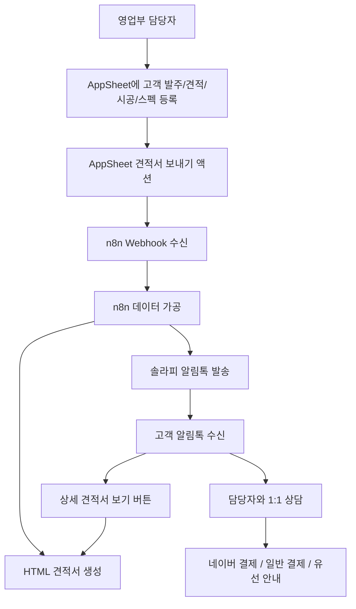
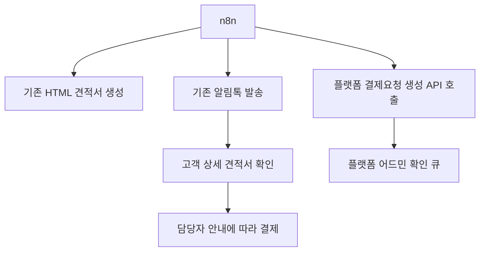
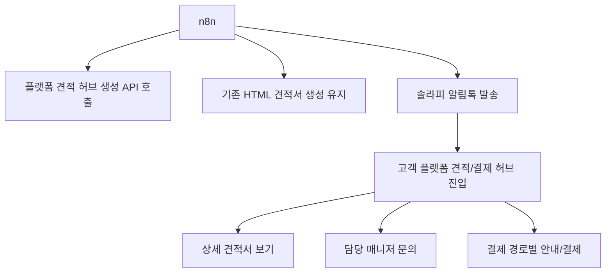

# 견적·결제 흐름 지도

## 목적

문장군 플랫폼의 견적/결제 기능을 구현하기 전에, 현재 운영 중인 AppSheet, n8n, 솔라피 알림톡, HTML 견적서 흐름을 먼저 지도화한다.

핵심 목적은 두 가지다.

1. 영업부 담당자가 같은 견적/시공/스펙 정보를 AppSheet와 플랫폼에 두 번 입력하지 않게 한다.
2. 네이버 결제, 일반/계좌 결제, 향후 플랫폼 결제가 공존할 수 있는 분기 구조를 먼저 만든다.

## 현재 운영 흐름

현재 확인된 사실:

- 영업부 담당자는 AppSheet에서 견적/시공/스펙을 등록한다.
- 영업부 담당자는 생성된 HTML 견적서 링크를 직접 다루지 않는다.
- AppSheet의 `견적서 보내기` 액션이 n8n으로 데이터를 전달한다.
- n8n은 데이터를 가공해 HTML 견적서를 만들고, 솔라피 알림톡을 보낸다.
- 알림톡에는 `상세 견적서 보기`, `담당자와 1:1 상담하기` 버튼이 있다.
- 기존 HTML 견적서에는 고객명, 현장 주소, 견적일자, 견적 품목, 온라인 결제 항목, 일반 결제 항목, 시공 상세 정보, 총액, 계약금, 잔금, 입금계좌, 담당자 정보가 들어간다.

## 문제 정의

플랫폼에서 별도의 견적서 작성 기능을 바로 만들면 다음 문제가 생길 수 있다.

- AppSheet에 이미 입력한 견적/시공/스펙을 플랫폼에 다시 입력해야 한다.
- 기존 알림톡 견적서와 플랫폼 견적서가 서로 다른 정보를 보여줄 수 있다.
- 영업부 담당자 입장에서는 새 시스템이 업무를 줄이는 것이 아니라 늘리는 것으로 느껴질 수 있다.
- 결제 경로가 네이버/일반/플랫폼으로 갈라지는데, 플랫폼 결제만 전제로 하면 실제 운영과 맞지 않는다.

## 역할 경계

| 영역 | 현재 역할 | 당장 유지 여부 | 플랫폼이 맡을 가능성 |
|---|---|---:|---|
| AppSheet | 고객 발주, 견적, 시공, 스펙 등록의 운영 원장 | 유지 | 외부 참조 ID와 상태 매칭 |
| n8n | AppSheet payload 가공, HTML 생성, 알림톡 발송 | 유지 | 플랫폼 API 호출, AI 자동화 확장 |
| 솔라피 | 알림톡 발송 | 유지 | 버튼 링크 분기 |
| HTML 견적서 | 고객 상세 견적 확인 | 유지 또는 단계 전환 | 플랫폼 상세 화면으로 흡수 가능 |
| 문장군 플랫폼 | 접수/마이페이지/어드민 큐 | 확장 예정 | 견적 허브, 결제/입금 확인 큐, 고객 보관함 |

## 결제 경로 분기

견적 1건은 결제 경로를 가져야 한다.

| payment_route | 의미 | 고객 화면 | 어드민 큐 |
|---|---|---|---|
| `naver` | 네이버 결제 또는 네이버 장바구니 안내 | 네이버 결제 안내, 담당 매니저 문의 | 네이버 결제 확인필요 또는 수동 확인 |
| `bank_transfer` | 계좌이체/일반 결제 | 입금 계좌, 입금 전 확인, 담당 매니저 문의 | 입금 확인필요 |
| `platform` | 문장군 플랫폼 결제 | 결제 전 확인/설문, 플랫폼 결제 버튼 | 결제완료 확인필요 |
| `split` | 계약금/잔금 또는 혼합 결제 | 회차별 결제/입금 안내 | 회차별 확인필요 |

기본 원칙:

- 결제 경로는 견적서 생성 시점 또는 결제 안내 시점에 결정된다.
- 플랫폼은 결제 경로를 강제하지 않고, 해당 견적의 결제 방법을 명확히 안내한다.
- 플랫폼 결제는 `platform` 또는 `split`의 일부로 도입한다.

## 플랫폼이 끼어드는 후보 위치

### 옵션 A - 기존 알림톡/HTML 유지, 플랫폼은 결제 요청만 받음

장점:

- 기존 운영을 가장 적게 건드린다.
- 실패 시 플랫폼 API 호출만 끄면 된다.

단점:

- 고객 경험이 기존 견적서와 플랫폼으로 나뉜다.
- 플랫폼 마이페이지의 견적 보관 가치가 약할 수 있다.

### 옵션 B - 알림톡 버튼을 플랫폼 견적/결제 허브로 보냄

장점:

- 고객의 견적 확인, 문의, 결제, 마이페이지 보관을 한 곳으로 모은다.
- 기존 HTML 견적서를 백업 또는 상세 보기로 유지할 수 있다.

단점:

- 알림톡 버튼 링크 전환이 필요하다.
- 로그인/권한/고객 식별 UX를 신중히 설계해야 한다.

### 옵션 C - HTML 견적서 생성 자체를 플랫폼으로 이관

장점:

- 장기적으로 견적/결제/이력 원장이 플랫폼에 모인다.

단점:

- 지금 바로 진행하면 리스크가 크다.
- 기존 n8n/HTML/알림톡 흐름을 크게 바꿔야 한다.

## 현재 추천

즉시 구현 추천은 아니다.

먼저 현재 n8n 워크플로우와 AppSheet payload를 확인한 뒤, **옵션 A 또는 B의 작은 실험**을 선택한다.

현재 감각상 가장 현실적인 중간안:

- n8n은 기존 HTML 견적서와 알림톡을 계속 만든다.
- 동시에 플랫폼 API에도 같은 payload 또는 요약 payload를 보낸다.
- 플랫폼은 결제 경로별 고객 허브와 어드민 확인 큐를 만든다.
- 알림톡 버튼 전환은 바로 하지 않고, 테스트 견적에서만 검증한다.

## n8n MCP 판단

n8n MCP 연결은 장기적으로 의미가 있다.

가능한 용도:

- Codex가 n8n 워크플로우 구조를 읽고 설명
- 테스트용 워크플로우 호출
- AI가 자동화 흐름을 점검하거나 문서화

단, 견적/결제 연동의 첫 단계에 꼭 필요한 것은 아니다.

첫 단계에는 안정적인 플랫폼 API/Webhook 계약이 더 중요하다.

## 확인해야 할 것

- AppSheet에서 n8n으로 넘어가는 실제 payload 예시
- n8n 현재 워크플로우 이름과 주요 노드 순서
- HTML 견적서 생성 방식
- 솔라피 알림톡 템플릿과 버튼 제한
- 네이버 결제/일반 결제/플랫폼 결제의 실제 운영 비중
- 계약금/잔금 분기가 현재 AppSheet에서 어떻게 표현되는지
- 고객 로그인 필수 범위: 견적 요약, 상세 스펙, 결제 직전 각각 어디서 요구할지

## 금지 원칙

- 영업부가 AppSheet와 플랫폼에 견적/시공/스펙을 중복 입력하게 만들지 않는다.
- 기존 n8n 운영 워크플로우를 이해하기 전에 수정하지 않는다.
- 플랫폼 결제를 유일한 결제 경로로 가정하지 않는다.
- n8n을 제거 대상으로 보지 않는다.
