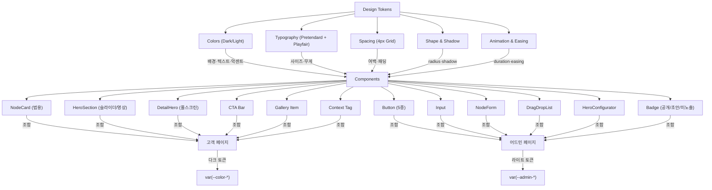

# 문장군 디지털 쇼룸 — Design System

> Version: 2.0.0 | Date: 2026-04-28 | Platform: Mobile-First | Stack: CSS Variables (Next.js)

---

## 0. 디자인 방향 (Design Direction)

**무드/톤:** 다크 미니멀 갤러리 — UI는 사라지고, 소재만 남는다
**레퍼런스:** Pantone 디지털 카탈로그 + 고급 소재 쇼룸 (갤러리 전시 컨셉)
**금지 사항:** 쇼핑몰 느낌, 화려한 그라디언트 UI, 원색 CTA, 카드 그림자 과다

### 디자인 원칙 (3가지)
1. **🔇 무음 UI:** UI는 존재감을 최소화하고, 제품 텍스처가 주인공. 인터페이스 요소는 절대 제품 이미지와 시선을 경쟁하지 않는다.
2. **🖼️ 갤러리 여백:** 넉넉한 여백으로 각 컬러 카드에 숨 쉴 공간을 부여한다. 밀도보다 여유가 프리미엄이다.
3. **✨ 절제된 고급감:** 샴페인 골드 악센트는 CTA와 핵심 포인트에만 사용. 그 외는 무채색으로 절제한다.

### 테마 전략
- **고객 페이지:** 다크 모드 고정 (다크/라이트 토글 없음). 제품 텍스처가 어두운 배경에서 가장 잘 보임.
- **어드민 페이지:** 라이트 모드 고정. 콘텐츠 관리 작업은 밝은 배경이 효율적.
- **다크/라이트 토글:** 없음. 각 영역이 고정된 테마를 사용.

---

## 1. 컬러 시스템

### 1.1 고객 페이지 팔레트 (다크)

| 토큰 | 헥스 | 용도 | 대비비 (on BG) |
|------|------|------|--------:|
| `--color-bg` | `#0C0C0E` | 전체 배경 | — |
| `--color-surface` | `#1A1A1F` | 카드, 패널 배경 | — |
| `--color-surface-elevated` | `#242429` | 호버 상태, 드롭다운 | — |
| `--color-accent` | `#C4A265` | CTA, 링크, 브랜드 포인트 | 7.8:1 ✅ |
| `--color-accent-hover` | `#D4B275` | Accent 호버 | 9.2:1 ✅ |
| `--color-accent-foreground` | `#0C0C0E` | Accent 위 텍스트 (다크) | 7.8:1 ✅ |
| `--color-text` | `#F5F5F7` | 기본 텍스트 | 18.9:1 ✅ |
| `--color-text-sub` | `#8E8E93` | 보조 텍스트, 캡션 | 5.2:1 ✅ |
| `--color-text-muted` | `#5A5A5F` | 비활성, 플레이스홀더 | 3.2:1 ⚠️ (대형만) |
| `--color-border` | `#2A2A30` | 구분선, 카드 테두리 | — |
| `--color-ring` | `#C4A265` | 포커스 링 | — |
| `--color-error` | `#EF4444` | 에러, 삭제 | 5.1:1 ✅ |
| `--color-success` | `#22C55E` | 성공, 공개 상태 | 6.3:1 ✅ |
| `--color-warning` | `#F59E0B` | 경고, 초안 상태 | 8.4:1 ✅ |
| `--color-info` | `#3B82F6` | 정보, 안내 | 4.7:1 ✅ |

### 1.2 어드민 페이지 팔레트 (라이트)

| 토큰 | 헥스 | 용도 | 대비비 (on Admin-BG) |
|------|------|------|--------:|
| `--admin-bg` | `#F8F8FA` | 어드민 전체 배경 | — |
| `--admin-surface` | `#FFFFFF` | 어드민 카드, 패널 | — |
| `--admin-surface-elevated` | `#F0F0F2` | 어드민 호버, 사이드바 | — |
| `--admin-text` | `#111114` | 어드민 기본 텍스트 | 17.4:1 ✅ |
| `--admin-text-sub` | `#6B6B73` | 어드민 보조 텍스트 | 5.1:1 ✅ |
| `--admin-text-muted` | `#9E9EA6` | 어드민 비활성 텍스트 | 3.1:1 ⚠️ (대형만) |
| `--admin-border` | `#E2E2E6` | 어드민 테두리 | — |
| `--admin-ring` | `#C4A265` | 어드민 포커스 링 | — |
| `--admin-accent` | `#C4A265` | 어드민 브랜드 포인트 | 3.3:1 ⚠️ |
| `--admin-accent-hover` | `#B08E50` | 어드민 accent 호버 | 4.0:1 ✅(large) |

### 1.3 CSS 변수 선언

```css
/* =============================================
   문장군 디지털 컬러북 — Design Tokens
   ============================================= */

:root {
  /* === 고객 페이지 (다크) === */
  --color-bg:                 #0C0C0E;
  --color-surface:            #1A1A1F;
  --color-surface-elevated:   #242429;

  --color-accent:             #C4A265;
  --color-accent-hover:       #D4B275;
  --color-accent-foreground:  #0C0C0E;

  --color-text:               #F5F5F7;
  --color-text-sub:           #8E8E93;
  --color-text-muted:         #5A5A5F;

  --color-border:             #2A2A30;
  --color-ring:               #C4A265;

  --color-error:              #EF4444;
  --color-success:            #22C55E;
  --color-warning:            #F59E0B;
  --color-info:               #3B82F6;

  /* === 어드민 페이지 (라이트) === */
  --admin-bg:                 #F8F8FA;
  --admin-surface:            #FFFFFF;
  --admin-surface-elevated:   #F0F0F2;
  --admin-text:               #111114;
  --admin-text-sub:           #6B6B73;
  --admin-text-muted:         #9E9EA6;
  --admin-border:             #E2E2E6;
  --admin-ring:               #C4A265;
  --admin-accent:             #C4A265;
  --admin-accent-hover:       #B08E50;
}
```

---

## 2. 타이포그래피

### 2.1 폰트 패밀리

| 용도 | 폰트 | 토큰 | Fallback | 로드 |
|------|------|------|----------|------|
| Display (영문 제목) | Playfair Display | `--font-display` | Georgia, serif | `next/font/google` (셀프 호스팅) |
| Body + 한글 전체 | Pretendard Variable | `--font-sans` | -apple-system, BlinkMacSystemFont, 'Segoe UI', sans-serif | CDN (jsDelivr) |

> 💡 **이중 폰트 전략 근거:**
> - **영문 제목(Display)**: Playfair Display 세리프로 럭셔리 브랜드의 격을 올린다. 히어로, 컬렉션 타이틀 등 큰 글씨에서만 사용.
> - **한글 본문 + 한글 제목**: Pretendard Variable 유지. 모바일 13~15px 가독성 최강이며, 카카오톡 인앱 브라우저에서 검증 완료.
> - 세리프(Playfair)와 산세리프(Pretendard)의 대비가 "절제된 고급감" 디자인 원칙과 일치한다.
> - `--font-display`는 영문 태그라인/섹션 라벨 등 **포인트 요소에만** 사용하며, 남용 금지.

### 2.2 폰트 로드

```css
/* Pretendard (CDN) */
@import url('https://cdn.jsdelivr.net/gh/orioncactus/pretendard@v1.3.9/dist/web/variable/pretendardvariable-dynamic-subset.min.css');
```

```tsx
/* Playfair Display (next/font/google — layout.tsx) */
import { Playfair_Display } from "next/font/google";

const playfairDisplay = Playfair_Display({
  subsets: ["latin"],
  weight: ["400", "600", "700"],
  style: ["normal", "italic"],
  display: "swap",
  variable: "--font-display",
});

// <html> 에 className={playfairDisplay.variable} 적용
```

### 2.3 타이포그래피 스케일 & 사용 규칙

```css
:root {
  --font-sans: 'Pretendard Variable', 'Pretendard', -apple-system,
               BlinkMacSystemFont, 'Segoe UI', sans-serif;
  --font-display: var(--font-display, 'Playfair Display'), 'Georgia', serif;

  --text-xs:   0.6875rem;  /* 11px */
  --text-sm:   0.8125rem;  /* 13px */
  --text-base: 0.9375rem;  /* 15px */
  --text-lg:   1.125rem;   /* 18px */
  --text-xl:   1.375rem;   /* 22px */
  --text-2xl:  1.75rem;    /* 28px */
  --text-3xl:  2rem;       /* 32px */
  --text-4xl:  2.25rem;    /* 36px */

  --leading-tight:   1.2;
  --leading-snug:    1.4;
  --leading-normal:  1.5;
  --leading-relaxed: 1.65;
  --leading-loose:   1.8;

  --font-regular:  400;
  --font-medium:   500;
  --font-semibold: 600;
  --font-bold:     700;
  --font-extrabold: 800;
}
```

| 역할 | 사이즈 | 무게 | Line Height | 폰트 | 사용처 |
|------|--------|------|-------------|------|--------|
| 영문 태그라인 | `--text-xl` (22px) | `--font-regular` | snug | `--font-display` (italic) | 히어로 영문 카피 |
| 영문 섹션 라벨 | `--text-xs` (11px) | `--font-semibold` | normal | `--font-display` | 컬렉션 영문 라벨, uppercase |
| 컬러명 (히어로 H1) | `--text-3xl` (32px) | `--font-extrabold` | tight | `--font-sans` | 상세 페이지 컬러 이름 |
| 페이지 제목 (H1) | `--text-4xl` (36px) | `--font-bold` | tight | `--font-sans` | 디자인 시스템 전용 |
| 컬렉션 제목 (H2) | `--text-xl` (22px) | `--font-bold` | snug | `--font-sans` | 메인 카탈로그 컬렉션 헤더 |
| 카드 제목 | `--text-lg` (18px) | `--font-semibold` | snug | `--font-sans` | 컬러 카드 이름 |
| 태그라인 | `--text-base` (15px) → `--text-lg` (16px) | `--font-medium` | normal | `--font-sans` | 한 줄 카피, accent 색 |
| 본문 | `--text-base` (15px) | `--font-regular` | relaxed~loose | `--font-sans` | 상세 설명 |
| 라벨/캡션 | `--text-sm` (13px) | `--font-medium` | normal | `--font-sans` | 컬렉션 태그, 카운트 |
| 마이크로 | `--text-xs` (11px) | `--font-regular` | normal | `--font-sans` | 날짜, 저작권, 아주 작은 주석 |
| 섹션 라벨 | `--text-xs` (11px) | `--font-semibold` | normal | `--font-sans` | `letter-spacing: 3px`, uppercase, accent 색 |

---

## 3. 간격 시스템 (4px 베이스 그리드)

```css
:root {
  --space-0:  0px;
  --space-1:  4px;    /* 0.25rem */
  --space-2:  8px;    /* 0.5rem  */
  --space-3:  12px;   /* 0.75rem */
  --space-4:  16px;   /* 1rem    */
  --space-5:  20px;   /* 1.25rem */
  --space-6:  24px;   /* 1.5rem  */
  --space-8:  32px;   /* 2rem    */
  --space-10: 40px;   /* 2.5rem  */
  --space-12: 48px;   /* 3rem    */
  --space-16: 64px;   /* 4rem    */
  --space-20: 80px;   /* 5rem    */
}
```

### 사용 규칙

| 상황 | 토큰 |
|------|------|
| 아이콘 ↔ 텍스트 | `--space-2` (8px) |
| 뱃지/태그 내부 패딩 | `--space-1` × `--space-3` (4px 10px) |
| 컴포넌트 내부 패딩 | `--space-3` ~ `--space-4` |
| 카드 패딩 | `--space-4` ~ `--space-5` |
| 컬러 카드 그리드 갭 | `--space-4` (16px) |
| 컬렉션 섹션 간격 | `--space-12` (48px) |
| 페이지 좌우 여백 | `--space-6` (24px, 모바일) / `--space-8` (32px, 데스크탑) |
| 상세 페이지 info 패딩 | `--space-8` × `--space-5` (32px 20px) |
| 갤러리 사진 간격 | `--space-4` (16px) |

> ⛔ **절대 규칙:** 모든 간격은 4px 배수여야 한다. 5px, 7px, 13px, 15px 같은 값은 사용하지 않는다.

---

## 4. 형태 시스템 (Shape & Shadow)

```css
:root {
  /* === Border Radius === */
  --radius-sm:   4px;     /* 뱃지, 태그 */
  --radius-md:   8px;     /* 버튼, 인풋 */
  --radius-lg:   12px;    /* 카드, 갤러리 사진 */
  --radius-xl:   16px;    /* 모달, 상세 페이지 컨테이너 */
  --radius-2xl:  24px;    /* 큰 패널 */
  --radius-full: 9999px;  /* 컬렉션 태그, 뱃지 알약형 */

  /* === Shadow (다크 테마용 — 더 강한 그림자) === */
  --shadow-sm:  0 1px 3px rgba(0,0,0,0.3);
  --shadow-md:  0 4px 12px rgba(0,0,0,0.4);
  --shadow-lg:  0 8px 24px rgba(0,0,0,0.5);
  --shadow-xl:  0 16px 48px rgba(0,0,0,0.6);

  /* === Shadow (어드민 라이트용) === */
  --admin-shadow-sm:  0 1px 3px rgba(0,0,0,0.06);
  --admin-shadow-md:  0 4px 12px rgba(0,0,0,0.08);
  --admin-shadow-lg:  0 8px 24px rgba(0,0,0,0.12);
}
```

| 요소 | Radius | Shadow | 비고 |
|------|--------|--------|------|
| 상태 뱃지 (공개/초안) | `--radius-full` | 없음 | 알약형 |
| 컬렉션 태그 | `--radius-full` | 없음 | 알약형, border |
| 버튼/인풋 | `--radius-md` | 없음 | |
| 컬러 카드 | `--radius-lg` | 없음 (border로 구분) | 호버 시 `--shadow-lg` |
| 갤러리 사진 | `--radius-lg` | 없음 | |
| 모달/바텀시트 | `--radius-xl` | `--shadow-lg` | |
| 상세 페이지 (모바일에서는 풀워드) | 0 | 없음 | 실제 모바일에서는 radius 없음 |

---

## 5. 애니메이션 & 트랜지션

```css
:root {
  /* === Duration === */
  --duration-fast:   150ms;
  --duration-normal: 250ms;
  --duration-slow:   400ms;
  --duration-gallery: 600ms;  /* 시공 갤러리 등장 전용 */

  /* === Easing === */
  --ease-default:    cubic-bezier(0.4, 0, 0.2, 1);
  --ease-in:         cubic-bezier(0.4, 0, 1, 1);
  --ease-out:        cubic-bezier(0, 0, 0.2, 1);
  --ease-bounce:     cubic-bezier(0.68, -0.55, 0.265, 1.55);

  /* === Composed === */
  --transition-fast:    var(--duration-fast) var(--ease-default);
  --transition-normal:  var(--duration-normal) var(--ease-default);
  --transition-slow:    var(--duration-slow) var(--ease-out);
  --transition-gallery: var(--duration-gallery) var(--ease-out);
}
```

### 사용 규칙

| 상황 | 트랜지션 | 속성 |
|------|---------|------|
| 버튼 호버/프레스 | `--transition-fast` | background-color, transform |
| 컬러 카드 호버 | `--transition-normal` | transform, box-shadow, border-color |
| 포커스 링 | `--transition-fast` | box-shadow |
| CTA 바 등장 | `--transition-slow` | opacity, transform |
| 갤러리 사진 스크롤 등장 | `--transition-gallery` | opacity, transform |
| 컬러 정보 fade-in | `--transition-slow` | opacity, transform |

### 스크롤 애니메이션 (Framer Motion 또는 Intersection Observer)

```
갤러리 사진 등장:
  - 효과: fade-in (opacity 0→1) + slide-up (translateY 24px→0)
  - 순차 지연: 각 사진마다 150ms stagger
  - 트리거: 뷰포트 진입 (threshold: 0.15)
  - Easing: ease-out
  - Duration: 600ms

컬러 정보 등장:
  - 효과: fade-in (opacity 0→1)
  - Duration: 400ms
  - 트리거: 뷰포트 진입
```

### 인터랙션 피드백

```css
/* 버튼 프레스 효과 */
.btn:active { transform: scale(0.97); }

/* 컬러 카드 호버 */
.color-card:hover {
  transform: translateY(-6px);
  box-shadow: var(--shadow-lg);
  border-color: var(--color-accent);
}

/* Ghost 버튼 호버 */
.btn-ghost:hover {
  background: rgba(255, 255, 255, 0.08);
  color: var(--color-text);
}
```

### 모션 접근성 (필수)

```css
@media (prefers-reduced-motion: reduce) {
  *, *::before, *::after {
    animation-duration: 0.01ms !important;
    animation-iteration-count: 1 !important;
    transition-duration: 0.01ms !important;
    scroll-behavior: auto !important;
  }
}
```

---

## 6. 반응형 브레이크포인트

```css
:root {
  --breakpoint-sm:  375px;   /* 모바일 소 (기준) */
  --breakpoint-md:  768px;   /* 태블릿 */
  --breakpoint-lg:  1024px;  /* 데스크탑 */
  --breakpoint-xl:  1280px;  /* 와이드 */
}
```

### 레이아웃 규칙

| 플랫폼 | 카드 그리드 | 좌우 여백 | 특이사항 |
|--------|-----------|----------|---------|
| 모바일 (< 768px) | **2열** | 24px | 히어로 `100dvh`, CTA 하단 고정 |
| 태블릿 (768~1023px) | **3열** | 32px | |
| 데스크탑 (1024~1279px) | **4열** | 40px | 최대 너비 1200px |
| 와이드 (≥ 1280px) | **4열** | auto | 최대 너비 1200px, 중앙 정렬 |

### 카카오톡 인앱 브라우저 대응 (필수)

```css
/* ❌ 금지 — 카카오 인앱에서 뷰포트 높이 오계산 */
height: 100vh;

/* ✅ 필수 — Dynamic Viewport Height */
height: 100dvh;

/* ✅ Fallback (dvh 미지원 브라우저용) */
height: 100vh;
height: 100dvh;
```

---

## 7. 아이콘 시스템

**라이브러리:** Lucide React (`lucide-react`)
**선정 이유:** Next.js 생태계 표준, 트리쉐이킹 지원, 깔끔한 선형 아이콘

### 사이즈 규칙

| 용도 | 사이즈 | 예시 |
|------|--------|------|
| 인라인 (텍스트 옆) | 16px | 화살표, 외부링크 |
| 버튼 내부 | 20px | 추가, 편집, 삭제 |
| 내비게이션/사이드바 | 24px | 어드민 메뉴 |
| 빈 상태/일러스트 | 32~48px | "컬러가 없습니다" |

> 아이콘 컬러는 항상 `currentColor` — 부모의 텍스트 색상을 자동 상속.

---

## 8. 컴포넌트 규칙

### 버튼

| 타입 | 배경 | 텍스트 | 용도 |
|------|------|--------|------|
| Primary | `--color-accent` | `--color-accent-foreground` (#0C0C0E) | 핵심 CTA (화면 당 1개) |
| Secondary | `--color-surface-elevated` | `--color-text` | 보조 액션, border 있음 |
| Ghost | `rgba(255,255,255,0.06)` | `--color-text-sub` → hover: `--color-text` | 취소, 닫기, 비강조 |
| Danger | `--color-error` | white | 삭제, 위험 액션 |
| Outline | transparent + `1px solid --color-border` | `--color-accent` | 덜 강조 액션 |

- 높이: **44px** (모바일 터치 타겟) / **36px** (데스크탑 compact)
- 좌우 패딩: `--space-6` (24px)
- 폰트: `--text-sm` (14px), `--font-semibold`
- Radius: `--radius-md` (8px)
- 트랜지션: `--transition-fast`
- Disabled: `opacity: 0.5; cursor: not-allowed; pointer-events: none;`

### 인풋 필드

- 높이: **48px** (모바일) / **40px** (데스크탑)
- 배경: `var(--color-surface)` (고객) / `var(--admin-surface)` (어드민)
- 테두리: `1px solid var(--color-border)`
- 포커스: `border-color: var(--color-accent)` + `box-shadow: 0 0 0 3px rgba(196,162,101,0.15)`
- Radius: `--radius-md`
- 플레이스홀더: `var(--color-text-muted)`
- Error 상태: 테두리 `var(--color-error)`

### 노드 카드 (NodeCard — 범용, v2 신규)

> v1의 ColorCard를 대체. listing/detail 모두 동일 카드 컴포넌트로 렌더링.

- 배경: `var(--color-surface)`
- 테두리: `1px solid var(--color-border)`
- Radius: `--radius-lg` (12px)
- 이미지 Aspect Ratio: `3:4` (세로형 — 텍스처/디자인을 크게 보여줌)
- 하단 정보: name + card_subtitle
- 하단 정보 패딩: `12px 14px 14px`
- 호버: `translateY(-6px)` + `shadow-lg` + `border-color: accent`
- listing 카드: 우측 하단 화살표 아이콘 (드릴다운 암시)
- detail 카드: 화살표 없음

```css
.node-card {
  background: var(--color-surface);
  border: 1px solid var(--color-border);
  border-radius: var(--radius-lg);
  overflow: hidden;
  transition: transform var(--transition-normal),
              box-shadow var(--transition-normal),
              border-color var(--transition-normal);
}
.node-card:hover {
  transform: translateY(-6px);
  box-shadow: var(--shadow-lg);
  border-color: var(--color-accent);
}
```

### 히어로 섹션 (HeroSection — v2 신규)

> 메인 페이지 및 listing 노드의 선택적 히어로. 이미지 슬라이더 또는 영상 자동재생.

- 모드: 이미지 1장 | 이미지 복수 (자동 슬라이딩) | 영상 (자동재생, muted)
- 높이: `100dvh` (메인/상세 히어로) 또는 `60dvh` (listing 히어로)
- 오버레이: 상단 문구 + 메인 문구 + 하단 문구 (CSS gradient overlay)
- 오버레이 그라디언트: `linear-gradient(to top, rgba(12,12,14,0.7) 0%, transparent 50%)`
- 슬라이더 전환: `--duration-slow` (400ms), fade 또는 slide
- 영상 폴백: `autoplay muted loop playsinline` (카카오톡 인앱 호환)
- 영상 실패 시: 첫 번째 hero_media 이미지로 fallback

### 상세 페이지 히어로 (DetailHero — v1 유지)

- 이미지: `object-fit: cover`, 너비 100%, 높이 `100dvh`
- 하단 그라디언트: `linear-gradient(to top, var(--color-bg) 0%, transparent 60%)`
- 스크롤 인디케이터: 하단 중앙 캐버런 애니메이션

### 상태 뱃지 (어드민)

| 상태값 (DB) | 표시 텍스트 (한글) | 색상 |
|------------|-----------------|------|
| `published` | **공개** | `--color-success` 배경 15% + 텍스트 |
| `draft` | **초안** | `--color-warning` 배경 15% + 텍스트 |
| — | **고객 미노출** | `--color-info` 배경 15% + 텍스트 (하위 노드 0개일 때) |

- 형태: 알약형 (`--radius-full`)
- 패딩: `4px 10px`
- 폰트: `--text-xs` (11px), `--font-semibold`, `letter-spacing: 0.5px`

```css
.badge-published {
  background: rgba(34, 197, 94, 0.15);
  color: var(--color-success);
}
.badge-draft {
  background: rgba(245, 158, 11, 0.15);
  color: var(--color-warning);
}
.badge-no-children {
  background: rgba(59, 130, 246, 0.15);
  color: var(--color-info);
}
```

### CTA 바 (고객 페이지 하단)

- 배경: `var(--color-surface-elevated)`
- 상단 테두리: `1px solid var(--color-border)`
- 패딩: `16px 20px`
- 레이아웃: flex, gap: 12px
- 동작: 히어로 섹션에서는 숨김, 스크롤 다운 시 하단 고정(sticky)
- Primary 버튼: "무료 방문실측 예약"
- Secondary 버튼: "브랜드스토어"

### 컨텍스트 태그 (상세 페이지 — 부모 노드명 표시)

> v1의 컬렉션 태그 확장. 부모 노드 이름을 표시하여 위치 컨텍스트 제공.

- 형태: 알약형 (`--radius-full`), border
- 스타일: `1px solid rgba(196,162,101,0.3)`
- 텍스트: `--text-xs`, `--font-medium`, `letter-spacing: 2px`, uppercase
- 색상: `--color-accent`
- 패딩: `4px 12px`

### 어드민 전용 컴포넌트 (v2 신규)

#### NodeForm (노드 편집기)
- 레이아웃: 상단 타입 선택 (listing/detail) → 타입별 필드 동적 표시
- listing 선택 시: 히어로 설정 영역 표시 (HeroConfigurator)
- detail 선택 시: tagline, description, 갤러리 관리 영역 표시
- 배경: `var(--admin-surface)`, 테두리: `var(--admin-border)`

#### DragDropList (드래그앤드롭 정렬)
- 드래그 핸들: 좌측 그립 아이콘 (6점 도트)
- 드래그 중 상태: `opacity: 0.5` + `border: 2px dashed var(--admin-accent)`
- 드롭 타겟: `background: rgba(196,162,101,0.08)` 하이라이트

#### HeroConfigurator (히어로 설정 UI)
- hero_enabled 토글 스위치
- 이미지 복수 업로드 + 정렬
- 영상 URL 입력
- 상단/메인/하단 문구 입력
- 미리보기 영역

---

## 9. 접근성 기준 (a11y)

### 대비비 규칙 (WCAG AA)
- **일반 텍스트** (< 18px, < 14px bold): 최소 대비비 **4.5:1**
- **대형 텍스트** (≥ 18px bold 또는 ≥ 24px): 최소 대비비 **3:1**
- **UI 컨트롤** (버튼, 인풋 테두리): 최소 대비비 **3:1**

### 포커스 표시
```css
:focus-visible {
  outline: 2px solid var(--color-ring);
  outline-offset: 2px;
}
```

### 터치 타겟
- 모든 인터랙티브 요소: 최소 **44 × 44px** 터치 영역
- 인접 터치 요소 간격: 최소 **8px**

### 모션 접근성
- `prefers-reduced-motion: reduce` 미디어 쿼리 필수 지원
- 자동 재생 애니메이션 금지 (사용자 스크롤 트리거만 허용)

### 이미지 접근성
- 모든 텍스처/시공 이미지에 의미 있는 `alt` 텍스트
- 예: `alt="월넛 우드 텍스처"`, `alt="월넛 거실 중문 시공 사례"`
- 순수 장식용 이미지: `alt=""`

---

## 10. 명시적 Out-of-Scope (이 디자인 시스템이 다루지 않는 것)

> ⛔ 아래 항목은 v2.0에서 의도적으로 제외한다. 에이전트는 구현하지 않는다.

- **[DS-X001]** 다크/라이트 토글 UI — 고객=다크, 어드민=라이트 고정
- **[DS-X002]** 3D 효과 / WebGL 기반 비주얼
- **[DS-X003]** 복잡한 SVG 일러스트레이션 가이드라인
- **[DS-X004]** 이메일 템플릿 전용 스타일
- **[DS-X005]** 인쇄(Print) 전용 스타일
- **[DS-X006]** 다국어(i18n) 토큰 — 한국어 단일 언어
- **[DS-X007]** 카드 템플릿 시스템 — v2.1로 이관 (MVP에서는 단일 카드 디자인)
- **[DS-X008]** 섹션 빌더/비주얼 에디터 — v2.2+로 이관

---

## 11. 토큰 의존성 구조



---

## 12. AI Evals & 품질 관문

> 에이전트가 UI 코드를 커밋하기 전 반드시 통과해야 하는 검증 기준

- [ ] **DS-EVAL-01:** 모든 컬러가 CSS 변수(`var(--color-*)` 또는 `var(--admin-*)`)로 사용되고, 하드코딩된 헥스값이 없는가?
- [ ] **DS-EVAL-02:** 텍스트-배경 대비비가 WCAG AA(4.5:1) 이상인가? (`--color-text-muted`는 대형 텍스트에만 사용)
- [ ] **DS-EVAL-03:** 모든 간격이 4px 배수(`--space-N` 토큰)에서 벗어나지 않는가?
- [ ] **DS-EVAL-04:** 버튼/인풋 터치 타겟이 44px 이상인가?
- [ ] **DS-EVAL-05:** 고객 페이지가 다크 토큰, 어드민 페이지가 라이트 토큰을 사용하는가? 혼용 없는가?
- [ ] **DS-EVAL-06:** `prefers-reduced-motion` 대응이 되어 있는가?
- [ ] **DS-EVAL-07:** 포커스 링(`:focus-visible`)이 모든 인터랙티브 요소에 적용되었는가?
- [ ] **DS-EVAL-08:** Pretendard(본문) 및 Playfair Display(영문 Display) 폰트가 정상 로드되고, 폴백 폰트가 작동하는가?
- [ ] **DS-EVAL-09:** Ghost 버튼이 다크 배경에서 시각적으로 구분 가능한가? (`rgba(255,255,255,0.06)` 배경)
- [ ] **DS-EVAL-10:** 상태 뱃지가 한글(공개/초안/고객 미노출)로 표시되는가?
- [ ] **DS-EVAL-11:** 카카오톡 인앱 브라우저에서 히어로 높이가 `100dvh`로 정상 표시되는가?
- [ ] **DS-EVAL-12:** NodeCard가 listing/detail 구분 없이 범용으로 렌더링되는가?
- [ ] **DS-EVAL-13:** HeroSection 이미지 슬라이더 전환이 `--duration-slow`를 사용하는가?
- [ ] **DS-EVAL-14:** HeroSection 영상 자동재생 실패 시 정지 이미지 fallback이 작동하는가?
- [ ] **DS-EVAL-15:** 어드민 DragDropList에서 드래그 중 시각 피드백(opacity + dashed border)이 표시되는가?

---

## 13. AI 코딩 세션용 컨텍스트 블록

> 바이브코딩 세션 시작 시 이 블록을 붙여넣으세요.

```
문장군 디지털 쇼룸 디자인 시스템 v2.0:

무드: 다크 미니멀 갤러리 — UI는 사라지고, 소재만 남는다
플랫폼: 모바일 퍼스트 (고객=다크 고정 / 어드민=라이트 고정)
아키텍처: 만능 노드 CMS — listing 노드(카드 그리드) + detail 노드(상세 페이지)

고객 컬러 (다크):
- Accent: #C4A265 (샴페인 골드) / Hover: #D4B275
- BG: #0C0C0E / Surface: #1A1A1F / Elevated: #242429
- Text: #F5F5F7 / Sub: #8E8E93 / Muted: #5A5A5F
- Border: #2A2A30
- Error: #EF4444 / Success: #22C55E / Warning: #F59E0B

어드민 컬러 (라이트):
- BG: #F8F8FA / Surface: #FFFFFF / Text: #111114

폰트 (이중 전략):
- 영문 Display: Playfair Display (next/font/google, serif) → --font-display
- 한글 + 본문: Pretendard Variable (CDN, sans-serif) → --font-sans
아이콘: Lucide React — 16/20/24/32px

핵심 컴포넌트 (v2):
- NodeCard: 범용 카드 (listing/detail 공용), radius 12px, 이미지 3:4
- HeroSection: 이미지 슬라이더/영상 자동재생, listing 히어로 60dvh / 메인 100dvh
- DetailHero: 상세 풀스크린 히어로 100dvh
- StatusBadge: 공개/초안/고객미노출 3종
- NodeForm + DragDropList + HeroConfigurator (어드민)

핵심 규칙:
- 버튼 radius: 8px, 높이: 44px(모바일)/36px(데스크탑)
- 카드 radius: 12px, 이미지 3:4 비율
- 간격: 4px 배수만 사용 (--space-N 토큰)
- 컬러 하드코딩 금지 — 반드시 var(--color-*) 사용
- 텍스트 대비비 WCAG AA(4.5:1) 필수
- Ghost 버튼: rgba(255,255,255,0.06) 배경 (투명X)
- 히어로 높이: 100dvh (카톡 인앱 호환)
- hover: 150ms ease / 갤러리 등장: 600ms ease-out
- --font-display는 영문 포인트 요소에만 사용 (남용 금지)
- 금지: 100vh, 인라인 스타일, any 타입, 하드코딩 컬러, Framer Motion

이 규칙을 모든 컴포넌트에 일관되게 적용해줘.
```

---

## 14. 변경 이력

| 버전 | 날짜 | 변경 내용 |
|------|------|----------|
| 2.0.0 | 2026-04-28 | **v2 업데이트.** PRD_v2.0 연동. 컬러북→쇼룸 명칭 변경. ColorCard→NodeCard 범용화. HeroSection(슬라이더/영상), DetailHero, HeroConfigurator, NodeForm, DragDropList 추가. 상태 뱃지에 '고객 미노출' 추가. 토큰 의존성 그래프 재작성. AI Evals 15개로 확장. Framer Motion 제거(Intersection Observer 전용). |
| 1.0.0 | 2026-04-21 | 최초 작성. 다크 미니멀 갤러리 테마 확정. 고객(다크)/어드민(라이트) 분리. Ghost 버튼 배경 추가. 뱃지 한글화. |
