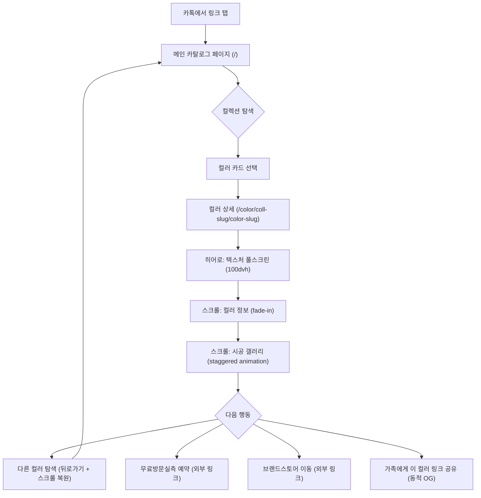
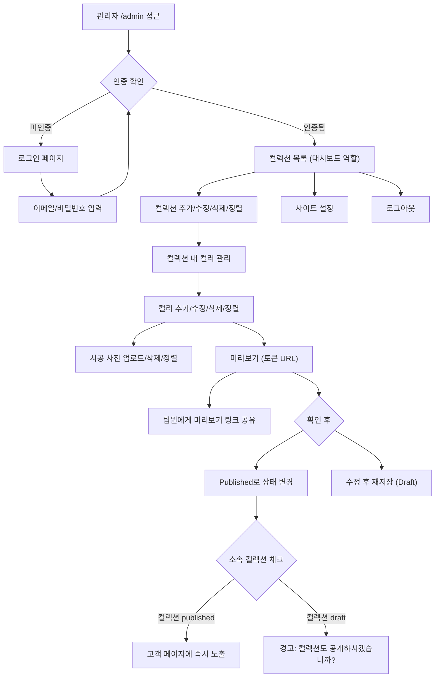
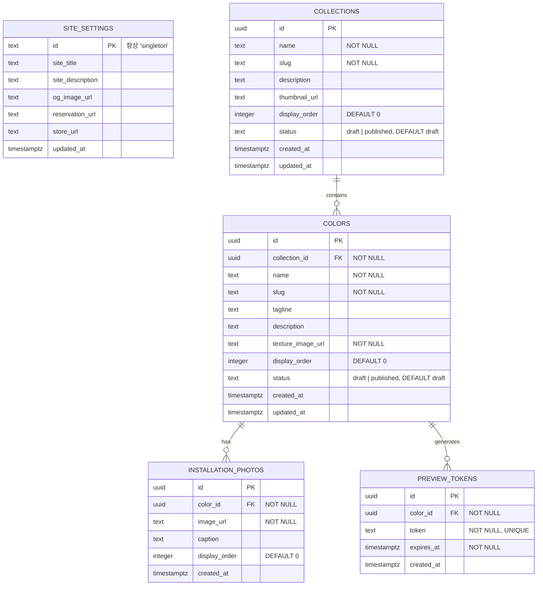

# 문장군 디지털 컬러북 — Product Requirements Document

## 1. Executive Summary (핵심 요약)

- **Vision Statement:** 영업사원이 카톡 링크 하나로 보내는, 현장 컬러북을 넘어서는 프리미엄 디지털 쇼룸.
- **Problem Space:** 스마트스토어 쇼핑스토리의 긴 통이미지 나열로는 중문 필름의 질감·분위기를 전달하기 어렵고, 고객(공실/미결정자)의 컬러 최종 결정이 지연됨. 콘텐츠 업데이트도 제약적.
- **Target Persona & Context:**
  - **영업사원**: 방문 실측 후 미결정 고객에게 카톡으로 **메인 페이지 링크 1개**를 전송. 고객이 알아서 탐색하도록 안내.
  - **고객**: 카톡에서 링크를 탭 → **카카오톡 인앱 브라우저 또는 모바일 브라우저**에서 컬렉션 탐색 → 원하는 컬러 상세 확인 → 최종 결정. 마음에 드는 컬러를 가족에게 공유하여 의견 수렴.
  - **관리자(사장님)**: 새 컬렉션/컬러 추가, 시공 사진 업로드를 개발자 없이 직접 수행.

## 2. Jobs-to-be-Done (사용자 과업 분석)

- **Functional Job:** 중문 필름 컬러를 고화질 텍스처와 실제 시공 사례로 온라인에서 몰입감 있게 탐색하여 최종 색상을 결정한다.
- **Emotional Job:** "이 색이 우리 집에 시공되면 이런 느낌이구나"라는 확신과 안심을 얻는다. 오프라인 컬러북을 못 봤어도 충분히 판단할 수 있다는 자신감.
- **Social Job:** "이 색 어때?" — 마음에 드는 컬러 페이지 링크를 가족·지인에게 카톡으로 보내 의견을 구한다. 컬러별 동적 OG로 링크만 보내도 어떤 색인지 미리보기로 바로 확인 가능.

## 3. Architectural Constraints (불변의 제약 조건)

> ⚠️ AI 에이전트가 아키텍처를 결정할 때 절대 위배해서는 안 되는 Hard Hooks

- **Tech Stack:**
  - Frontend: **Next.js (App Router)** — 설치 시점 최신 안정 버전
  - Backend/DB: **Supabase** (PostgreSQL + Storage + Auth)
  - Hosting: **Vercel**
  - Language: **TypeScript** (strict mode)

- **Security & RBAC:**
  - 고객 페이지: 인증 없음 (공개)
  - 어드민 페이지 (`/admin/*`): Supabase Auth (email/password), 단일 관리자 계정
  - 관리자 회원가입 비활성화 — 초기 계정은 Supabase 대시보드에서 수동 생성
  - Supabase Storage: 퍼블릭 읽기, 인증된 사용자만 업로드/삭제
  - RLS(Row Level Security) 활성화:
    - 고객 조회: `status = 'published'` **AND** 소속 컬렉션도 `status = 'published'`
    - 관리자: 전체 접근 (authenticated + role check)

- **카카오톡 인앱 브라우저 호환 필수:**
  - `100vh` 사용 금지 → `dvh` 또는 CSS 변수(`--vh`) + JS fallback 사용
  - Service Worker 의존 금지
  - position: fixed 사용 시 인앱 브라우저 키보드 이슈 고려
  - `-webkit-` 접두사 CSS 속성 호환 확인

- **CRITICAL RULES:**
  - `any` 타입 남용 금지 — 모든 데이터는 Supabase 자동 생성 타입 사용
  - `console.log` 잔류 금지 — 프로덕션 빌드에 로그 없어야 함
  - 레이아웃/디자인 목적의 인라인 스타일 금지 — CSS Modules 또는 체계적 스타일링 사용. **단, 애니메이션 라이브러리(Framer Motion 등)의 `style`/`animate` prop은 예외**
  - 하드코딩된 컬렉션/컬러 데이터 금지 — **모든 콘텐츠는 DB에서 동적 로딩**
  - 이미지 URL 직접 `` 사용 금지 — 반드시 `next/image` 컴포넌트 사용
  - 고객 페이지 컴포넌트에 어드민 로직 혼입 금지 — 완전 분리

- **한글 Slug 변환 규칙:**
  - 자동 생성: 한글 → 영문 번역 → 소문자 + 하이픈 (예: "오리지널 컬러" → `original-color`)
  - 관리자가 slug 필드를 직접 수정할 수 있어야 함
  - 중복 발생 시 자동 넘버링 서픽스 (`black`, `black-2`, `black-3`)
  - slug 허용 문자: `[a-z0-9-]` (영소문자, 숫자, 하이픈만)

- **필수 환경 변수:**
  ```
  NEXT_PUBLIC_SUPABASE_URL=         # Supabase 프로젝트 URL
  NEXT_PUBLIC_SUPABASE_ANON_KEY=    # Supabase 퍼블릭 키
  SUPABASE_SERVICE_ROLE_KEY=        # Supabase 서비스 롤 키 (서버 전용)
  NEXT_PUBLIC_SITE_URL=             # 사이트 도메인 (OG 태그용)
  ```

## 4. Features & Execution Scope (실행 범위)

### 🟢 Must Have (핵심 비즈니스 로직 — MVP)

---

#### **[F-001] 메인 카탈로그 페이지 (고객)**

- **Context:** 고객이 카톡 링크를 탭했을 때 처음 보는 화면. 모든 컬렉션과 컬러를 한눈에 조망하는 진입점.
- **Machine-Verifiable Criteria:**
  - `Given` published 상태의 컬렉션이 1개 이상, 각 컬렉션에 published 컬러가 1개 이상 존재
  - `When` 고객이 메인 페이지(`/`)에 접속
  - `Then` 컬렉션별 섹션으로 그룹핑된 컬러 카드가 display_order 순으로 렌더링됨
  - `Then` 각 컬러 카드에는 썸네일 이미지 + 컬러명이 표시됨
  - `Then` 컬러 카드 탭 시 `/color/[collection-slug]/[color-slug]` 상세 페이지로 이동
  - `Then` draft 상태의 컬렉션·컬러는 표시되지 않음
  - `Then` published 컬러가 0개인 published 컬렉션은 섹션 자체가 숨겨짐
  - `Then` 모바일(375px) 기준 카드 그리드 2열, 태블릿(768px) 3열, 데스크탑(1280px) 4열
  - `Then` 컬러 상세에서 뒤로가기 시 이전 스크롤 위치가 복원됨

---

#### **[F-002] 컬러 상세 페이지 (고객)**

- **Context:** 고객이 특정 컬러를 탭하면 진입하는 몰입형 상세 뷰. 매거진처럼 스크롤하며 텍스처와 시공 사례를 경험.
- **Machine-Verifiable Criteria:**
  - `Given` collection-slug가 "original-color"이고 color-slug가 "black"인 published 컬러가 DB에 존재, 소속 컬렉션도 published, 시공 사진 5장 연결됨
  - `When` 고객이 `/color/original-color/black`에 접속
  - `Then` 아래 섹션이 순서대로 렌더링됨:
    1. **히어로 섹션**: 텍스처 이미지가 뷰포트 100% 너비, 높이는 `100dvh` (카톡 인앱 호환)로 표시 (object-fit: cover)
    2. **컬러 정보 섹션**: 컬렉션명 태그 + 컬러명(h1) + 한 줄 카피 + 상세 설명
    3. **시공 갤러리 섹션**: 시공 사진이 display_order 순으로 나열, 각 사진은 뷰포트 진입 시 스크롤 애니메이션 트리거
    4. **하단 CTA 바**: 무료방문실측 예약 링크 + 브랜드스토어 링크 (고정 또는 플로팅)
  - `Then` 뒤로가기 또는 "전체 컬러 보기" 버튼으로 메인 페이지 복귀 가능
  - `When` draft 상태의 컬러 또는 draft 컬렉션 소속 컬러의 URL로 직접 접속
  - `Then` 404 페이지 표시

---

#### **[F-003] 스크롤 애니메이션 (고객)**

- **Context:** 정적 이미지 나열과 차별화되는 프리미엄 경험. 스크롤 시 콘텐츠가 살아 움직이는 느낌.
- **Machine-Verifiable Criteria:**
  - `Given` 컬러 상세 페이지의 시공 갤러리에 사진이 1장 이상 존재
  - `When` 사용자가 갤러리 영역으로 스크롤
  - `Then` 각 사진이 뷰포트에 진입할 때 fade-in + slide-up 애니메이션이 staggered(순차적 지연)로 실행됨
  - `Then` 컬러 정보 텍스트도 뷰포트 진입 시 fade-in 애니메이션 실행
  - `Then` 모든 애니메이션은 `prefers-reduced-motion: reduce` 미디어 쿼리 시 비활성화
  - `Then` 애니메이션 구현은 Intersection Observer API 또는 Framer Motion 사용 (Framer Motion의 style/animate prop은 인라인 스타일 금지 규칙의 예외)

---

#### **[F-004] 어드민 인증**

- **Context:** 관리자만 콘텐츠를 관리할 수 있도록 보호. 1인 관리자 전용.
- **Machine-Verifiable Criteria:**
  - `Given` 관리자 계정이 Supabase Auth에 수동 등록되어 있음
  - `When` 비인증 사용자가 `/admin` 경로에 접근
  - `Then` 로그인 페이지(`/admin/login`)로 리다이렉트
  - `When` 올바른 이메일/비밀번호로 로그인
  - `Then` 어드민 컬렉션 목록 페이지로 이동, 세션 유지
  - `When` 잘못된 자격 증명으로 로그인 시도
  - `Then` "이메일 또는 비밀번호가 올바르지 않습니다" 에러 메시지 표시
  - `Then` 회원가입 페이지/링크는 존재하지 않음
  - `When` 어드민 헤더의 "로그아웃" 버튼 클릭
  - `Then` 세션 무효화 후 로그인 페이지로 리다이렉트

---

#### **[F-005] 컬렉션 관리 (어드민)**

- **Context:** 관리자가 컬렉션(오리지널 컬러, 퍼스널 화이트 등)을 자유롭게 추가·수정·삭제·재정렬.
- **Machine-Verifiable Criteria:**
  - `Given` 관리자가 로그인한 상태
  - `When` 어드민 컬렉션 목록 페이지(`/admin/collections`)에 접근
  - `Then` 모든 컬렉션이 display_order 순으로 리스트 표시 (draft/published 상태 뱃지 + 하위 컬러 수 포함)
  - `When` "컬렉션 추가" 클릭 → 이름, 설명, 썸네일 이미지 입력 → 저장
  - `Then` 새 컬렉션이 draft 상태로 DB에 저장됨, slug 자동 생성 (한글→영문 변환, 관리자 수정 가능)
  - `When` 기존 컬렉션의 "수정" 클릭
  - `Then` 이름, 설명, slug, 썸네일, 상태(draft/published) 편집 가능
  - `When` 컬렉션 "삭제" 클릭
  - `Then` 확인 모달("하위 컬러 N개도 함께 삭제됩니다") → 승인 시:
    - 하위 모든 컬러의 시공 사진 파일을 Supabase Storage에서 삭제
    - 하위 모든 컬러의 텍스처 이미지 파일을 Supabase Storage에서 삭제
    - 컬렉션 썸네일 파일을 Supabase Storage에서 삭제
    - DB cascade 삭제 실행
  - `When` 드래그앤드롭으로 컬렉션 순서 변경
  - `Then` display_order가 업데이트됨

---

#### **[F-006] 컬러 관리 (어드민)**

- **Context:** 관리자가 특정 컬렉션 내에서 컬러를 추가·수정·삭제·재정렬.
- **Machine-Verifiable Criteria:**
  - `Given` 관리자가 "오리지널 컬러" 컬렉션의 컬러 관리 페이지에 접근
  - `Then` 해당 컬렉션에 속한 컬러들이 display_order 순으로 카드/리스트 표시
  - `When` "컬러 추가" 클릭 → 컬러 편집 폼으로 이동
  - `Then` 편집 폼에 다음 필드 존재:
    - 컬러명 (필수, text)
    - slug (자동 생성, 수동 수정 가능, 영문 소문자+하이픈만 허용)
    - 한 줄 카피 (선택, text)
    - 상세 설명 (선택, textarea)
    - 텍스처 메인 이미지 (필수, 이미지 업로드, **최대 10MB**)
    - 시공 사진 (복수, 이미지 업로드 + 순서 변경, **각 최대 10MB**)
    - 상태 (draft / published)
  - `When` 모든 필수 필드를 채우고 "저장"
  - `Then` 컬러가 DB에 저장됨
  - `When` 시공 사진 영역에서 이미지 다중 업로드 (드래그앤드롭 또는 파일 선택)
  - `Then` 각 사진이 Supabase Storage에 업로드되고 installation_photos 테이블에 레코드 생성
  - `When` 시공 사진 순서를 드래그앤드롭으로 변경
  - `Then` display_order 업데이트
  - `When` 컬러 "삭제" 클릭
  - `Then` 확인 모달 → 승인 시:
    - 하위 모든 시공 사진 파일을 Supabase Storage에서 삭제
    - 텍스처 이미지 파일을 Supabase Storage에서 삭제
    - DB cascade 삭제 실행

---

#### **[F-007] 이미지 업로드 & 최적화**

- **Context:** 고화질 이미지를 빠르게 로딩하기 위한 최적화 파이프라인.
- **Machine-Verifiable Criteria:**
  - `Given` 관리자가 이미지를 업로드하려 함
  - `When` 10MB 이하 JPG/PNG/WebP 파일을 선택
  - `Then` 업로드 진행 중 프로그레스 바 표시
  - `Then` 원본 이미지가 Supabase Storage `images` 버킷에 저장됨
  - `Then` 업로드 완료 후 미리보기 썸네일이 즉시 표시됨
  - `When` 10MB 초과 파일을 선택
  - `Then` "10MB 이하의 이미지만 업로드할 수 있습니다" 에러 표시, 업로드 차단
  - `When` JPG/PNG/WebP 외 파일 형식을 선택
  - `Then` "JPG, PNG, WebP 형식만 지원합니다" 에러 표시, 업로드 차단
  - `Given` 고객 페이지에서 해당 이미지를 로딩
  - `When` `next/image` 컴포넌트로 렌더링
  - `Then` 브라우저에 맞는 포맷(WebP/AVIF)과 적절한 사이즈로 자동 변환·서빙

---

#### **[F-008] 초안/미리보기/공개 워크플로우**

- **Context:** 관리자가 새 컬러를 추가할 때 바로 공개하지 않고, 확인 후 공개할 수 있는 안전장치. 미리보기를 팀원에게 공유 가능.
- **Machine-Verifiable Criteria:**
  - `Given` 관리자가 새 컬러를 생성하고 "저장"
  - `Then` 컬러가 `draft` 상태로 저장됨
  - `When` 관리자가 "미리보기" 버튼 클릭
  - `Then` 새 탭에서 고객 상세 페이지와 동일한 레이아웃으로 해당 컬러가 렌더링됨
  - `Then` 미리보기 URL에 토큰 파라미터 포함 (예: `/preview/[slug]?token=[random-token]`)
  - `Then` 해당 토큰이 유효한 동안 **비로그인자도 미리보기 열람 가능** (팀원 공유용)
  - `Then` 미리보기 페이지 상단에 "미리보기 모드" 배너 표시
  - `When` 관리자가 상태를 `published`로 변경하고 저장
  - `Then` 해당 컬러가 고객 메인 페이지에 표시됨
  - `When` 관리자가 기존 published 컬러를 `draft`로 변경
  - `Then` 고객 페이지에서 해당 컬러가 즉시 비표시
  - **계층 상태 규칙:**
    - 컬렉션이 `draft`이면, 하위 모든 컬러는 published여도 고객 페이지에 비표시
    - 컬러를 `published`로 변경할 때 소속 컬렉션이 `draft`이면 경고 메시지: "컬렉션이 비공개 상태입니다. 컬렉션도 함께 공개하시겠습니까?"

---

#### **[F-009] OG 메타 태그 (메인 + 컬러별 동적)**

- **Context:** 카톡으로 링크를 보냈을 때 미리보기가 근사하게 표시되어야 함. 메인 페이지뿐 아니라 컬러 상세 페이지도 해당 컬러에 맞는 OG가 동적 생성.
- **Machine-Verifiable Criteria:**
  - `Given` site_settings에 OG 이미지 URL, 사이트 제목, 사이트 설명이 설정됨
  - `When` 메인 페이지의 HTML `<head>`를 검사
  - `Then` 아래 메타 태그가 존재:
    - `og:title` = site_settings.site_title
    - `og:description` = site_settings.site_description
    - `og:image` = site_settings.og_image_url
    - `og:type` = "website"
    - `og:url` = 사이트 URL
  - `Given` "블랙" 컬러의 상세 페이지에 접속
  - `When` 해당 페이지의 HTML `<head>`를 검사
  - `Then` 아래 메타 태그가 **컬러별로 동적 생성**:
    - `og:title` = "[컬러명] | [컬렉션명] — 문장군 디지털 컬러북"
    - `og:description` = 컬러의 tagline 또는 description 앞 100자
    - `og:image` = 해당 컬러의 texture_image_url
    - `og:url` = 해당 컬러 상세 페이지 URL
  - `Then` Next.js Metadata API의 `generateMetadata` 함수로 구현

---

#### **[F-010] CTA 액션 (예약 & 스토어 연결)**

- **Context:** 컬러를 결정한 고객이 바로 다음 행동으로 이어질 수 있도록.
- **Machine-Verifiable Criteria:**
  - `Given` site_settings에 reservation_url과 store_url이 설정됨
  - `When` 고객이 컬러 상세 페이지를 스크롤
  - `Then` 하단에 고정(sticky) CTA 바가 표시됨:
    - "무료 방문실측 예약" 버튼 → site_settings.reservation_url로 새 탭 이동
    - "브랜드스토어 바로가기" 버튼 → site_settings.store_url로 새 탭 이동
  - `Then` CTA 바는 히어로 섹션에서는 숨겨지고 스크롤 다운 시 나타남
  - `When` 메인 카탈로그 페이지에서도 하단에 동일 CTA 바가 표시됨

---

#### **[F-011] 사이트 설정 관리 (어드민)**

- **Context:** OG 이미지, 예약 URL, 스토어 URL 등 전역 설정을 어드민에서 관리.
- **Machine-Verifiable Criteria:**
  - `Given` 관리자가 `/admin/settings` 페이지에 접근
  - `Then` 아래 필드가 편집 가능:
    - 사이트 제목 (text)
    - 사이트 설명 (textarea)
    - OG 이미지 (이미지 업로드)
    - 무료방문실측 예약 URL (text, URL 형식 검증)
    - 브랜드스토어 URL (text, URL 형식 검증)
  - `When` 저장 클릭
  - `Then` site_settings 테이블 업데이트 (싱글톤 row — UPSERT), 성공 토스트 표시

---

### 🟡 Should Have (v1.1 후속 릴리즈)

- **[F-101] 컬러 비교 기능** — 2~3개 컬러를 나란히 비교하는 화면
- **[F-102] 시공 사진 라이트박스** — 사진 탭 시 풀스크린 갤러리 뷰어 (스와이프 + 줌)
- **[F-103] ABS도어 라인업 확장** — 중문 외 ABS도어 제품군 추가
- **[F-104] 이전/다음 컬러 네비게이션** — 상세 페이지에서 같은 컬렉션의 이전/다음 컬러로 스와이프 또는 버튼 이동
- **[F-105] 방문자 통계** — 어떤 컬러가 가장 많이 조회되는지 추적 (간단한 page view 카운터)

### 🔴 Explicitly Out-of-Scope (절대 구현 금지 사항)

> ⛔ 에이전트의 스코프 크립 방지를 위한 가장 중요한 섹션.
> 아래 기능은 어떤 상황에서도 구현하지 않는다.

- **[X-001]** 결제/장바구니 기능: 이 사이트는 쇼핑몰이 아니라 컬러 쇼케이스. 구매는 스마트스토어에서 별도 진행.
- **[X-002]** 고객 회원가입/로그인: 고객은 인증 없이 자유롭게 탐색. 어떤 형태의 고객 계정 시스템도 금지.
- **[X-003]** 댓글/리뷰/문의 기능: 고객 소통은 카톡/전화로 별도 진행. 사이트 내 커뮤니케이션 기능 금지.
- **[X-004]** 다국어(i18n) 지원: 한국어 단일 언어. 번역 시스템 금지.
- **[X-005]** 검색/필터 기능: 초기 19종 + α 규모에서는 불필요. 검색바, 필터 드롭다운 금지.
- **[X-006]** 알림 시스템: 이메일/푸시/SMS 알림 일체 금지.
- **[X-007]** AR/VR 미리보기: 3D 뷰어, 카메라 활용 시뮬레이션 일체 금지.

## 5. Topological Context (구조 및 위상 흐름)

### 5.1 고객 User Flow



### 5.2 어드민 User Flow



### 5.3 Data Entity Relationship



**DB 제약 조건 (마이그레이션에 필수 반영):**
- `COLLECTIONS.slug`: UNIQUE
- `COLORS.(collection_id, slug)`: 복합 UNIQUE — 같은 컬렉션 내에서만 slug 유일
- `SITE_SETTINGS`: CHECK 제약 `(id = 'singleton')` + INSERT 트리거로 1 row 초과 방지
- `COLLECTIONS.status`: CHECK `(status IN ('draft', 'published'))`
- `COLORS.status`: CHECK `(status IN ('draft', 'published'))`
- `COLORS.collection_id`: ON DELETE CASCADE
- `INSTALLATION_PHOTOS.color_id`: ON DELETE CASCADE
- `PREVIEW_TOKENS.color_id`: ON DELETE CASCADE

### 5.4 디렉토리 구조 (권장)

```
munjanggun/
├── src/
│   ├── app/
│   │   ├── layout.tsx                 # 루트 레이아웃 (기본 OG 메타)
│   │   ├── page.tsx                   # 메인 카탈로그 페이지
│   │   ├── not-found.tsx              # 404 페이지
│   │   ├── color/
│   │   │   └── [collectionSlug]/
│   │   │       └── [colorSlug]/
│   │   │           └── page.tsx       # 컬러 상세 페이지 (동적 OG)
│   │   ├── preview/
│   │   │   └── [slug]/
│   │   │       └── page.tsx           # 토큰 기반 미리보기 (auth 불필요)
│   │   ├── admin/
│   │   │   ├── layout.tsx             # 어드민 레이아웃 (auth guard)
│   │   │   ├── login/
│   │   │   │   └── page.tsx           # 로그인 페이지
│   │   │   ├── collections/
│   │   │   │   ├── page.tsx           # 컬렉션 목록 (= 대시보드)
│   │   │   │   └── [id]/
│   │   │   │       └── colors/
│   │   │   │           ├── page.tsx       # 컬러 목록
│   │   │   │           └── [colorId]/
│   │   │   │               └── page.tsx   # 컬러 편집
│   │   │   └── settings/
│   │   │       └── page.tsx           # 사이트 설정
│   │   └── globals.css
│   ├── components/
│   │   ├── customer/                  # 고객 페이지 전용 컴포넌트
│   │   │   ├── CollectionSection.tsx
│   │   │   ├── ColorCard.tsx
│   │   │   ├── HeroTexture.tsx
│   │   │   ├── ColorInfo.tsx
│   │   │   ├── InstallationGallery.tsx
│   │   │   ├── CTABar.tsx
│   │   │   └── ScrollAnimationWrapper.tsx
│   │   └── admin/                     # 어드민 전용 컴포넌트
│   │       ├── AdminSidebar.tsx
│   │       ├── CollectionForm.tsx
│   │       ├── ColorForm.tsx
│   │       ├── ImageUploader.tsx
│   │       ├── DragDropList.tsx
│   │       └── StatusBadge.tsx
│   ├── lib/
│   │   ├── supabase/
│   │   │   ├── client.ts              # 브라우저 클라이언트
│   │   │   ├── server.ts              # 서버 컴포넌트 클라이언트
│   │   │   └── admin.ts               # 서비스 롤 (admin 작업용)
│   │   ├── utils.ts                   # 공통 유틸 (slug 생성 포함)
│   │   └── constants.ts               # 상수 정의
│   └── types/
│       └── database.ts                # Supabase 자동 생성 타입
├── public/
│   └── fonts/
├── docs/
│   ├── docs/showroom/PRD_v1.1.md                    # 이 문서
│   └── PROJECT_BRIEF.md               # 오피스아워 결과물 (추적용 복사본)
├── next.config.ts
├── package.json
└── tsconfig.json
```

## 6. AI Evals & Quality Gates (에이전트 검증 관문)

> 에이전트가 코드를 커밋하기 전 스스로 통과해야 하는 품질 기준

- [ ] **EVAL-01:** `npm run build`가 에러·워닝 없이 완료되는가?
- [ ] **EVAL-02:** 메인 카탈로그 → 컬러 상세 → CTA 클릭 → 뒤로가기(스크롤 복원) 플로우가 정상 작동하는가?
- [ ] **EVAL-03:** 어드민 로그인 → 컬렉션 추가 → 컬러 추가(이미지 포함) → 미리보기(토큰 URL 공유) → 공개 플로우가 정상 작동하는가?
- [ ] **EVAL-04:** Out-of-Scope 기능(결제, 회원가입, 검색, 댓글)이 구현되지 않았는가?
- [ ] **EVAL-05:** 모바일(375px) 뷰에서 메인 페이지와 상세 페이지가 정상 렌더링되는가?
- [ ] **EVAL-06:** draft 상태의 컬러가 고객 페이지에 절대 노출되지 않는가? draft 컬렉션 소속 published 컬러도 비표시인가?
- [ ] **EVAL-07:** Supabase RLS 정책이 적용되어, 비인증 사용자가 draft 데이터를 API로 조회할 수 없는가?
- [ ] **EVAL-08:** 모든 이미지가 `next/image`를 통해 렌더링되고, Lazy Loading이 적용되는가?
- [ ] **EVAL-09:** 스크롤 애니메이션이 `prefers-reduced-motion: reduce` 시 비활성화되는가?
- [ ] **EVAL-10:** `/admin` 경로가 비인증 접근 시 로그인 페이지로 리다이렉트되는가? 로그아웃이 정상 작동하는가?
- [ ] **EVAL-11:** 컬러 상세 페이지의 OG 태그가 해당 컬러의 텍스처 이미지와 이름으로 동적 생성되는가?
- [ ] **EVAL-12:** 히어로 섹션 높이가 `100dvh`를 사용하여 카카오톡 인앱 브라우저에서도 정상 표시되는가?
- [ ] **EVAL-13:** 10MB 초과 이미지 업로드 시 에러 메시지가 표시되고 업로드가 차단되는가?

## 7. Implementation Phases (구현 단계)

> WISC 격리(Isolate) 원칙: 각 Phase는 독립적인 에이전트 세션으로 실행 가능해야 한다.

### Phase 0: 기반 설정
- [ ] Next.js App Router 프로젝트 초기화 (TypeScript strict)
- [ ] Supabase 프로젝트 연결 — 환경 변수 설정:
  ```
  NEXT_PUBLIC_SUPABASE_URL
  NEXT_PUBLIC_SUPABASE_ANON_KEY
  SUPABASE_SERVICE_ROLE_KEY
  NEXT_PUBLIC_SITE_URL
  ```
- [ ] 디렉토리 구조 생성 (5.4 참조)
- [ ] 기본 레이아웃 + 글로벌 스타일 설정
- [ ] next.config.ts에 Supabase Storage 이미지 도메인 등록

### Phase 1: 데이터베이스 & 인증
- [ ] Supabase 테이블 스키마 마이그레이션:
  - `site_settings` (PK = 'singleton', CHECK 제약)
  - `collections` (slug UNIQUE)
  - `colors` (복합 UNIQUE: collection_id + slug, FK CASCADE)
  - `installation_photos` (FK CASCADE)
  - `preview_tokens` (token UNIQUE, FK CASCADE)
- [ ] RLS 정책:
  - `collections` SELECT: `status = 'published'` (anon) / 전체 (authenticated)
  - `colors` SELECT: `status = 'published' AND collection.status = 'published'` (anon) / 전체 (authenticated)
  - `installation_photos` SELECT: 소속 color가 published + 소속 collection이 published (anon) / 전체 (authenticated)
  - `site_settings` SELECT: 전체 공개 / UPDATE/INSERT: authenticated만
  - `preview_tokens` SELECT: token 일치 + 미만료 / INSERT/DELETE: authenticated만
- [ ] Supabase Storage 버킷 `images` 생성 + 정책 (공개 읽기, 인증 업로드/삭제)
- [ ] Supabase Auth 관리자 계정 수동 생성
- [ ] TypeScript 타입 자동 생성
- [ ] 초기 시드 데이터 (site_settings 싱글톤 + 4개 컬렉션 이름만)

### Phase 2: 어드민 CMS
- [ ] 어드민 레이아웃 + 사이드바 + auth guard 미들웨어
- [ ] 로그인 페이지 + 로그아웃 기능 [F-004]
- [ ] `/admin` → `/admin/collections` 리다이렉트
- [ ] 컬렉션 관리 페이지 [F-005] (CRUD + 드래그앤드롭 정렬 + Storage 삭제)
- [ ] 컬러 관리 페이지 [F-006] (CRUD + 이미지 업로드 + Storage 삭제)
- [ ] 이미지 업로더 컴포넌트 [F-007] (10MB 제한 + 프로그레스 바 + 미리보기)
- [ ] 초안/미리보기/공개 워크플로우 [F-008] (토큰 기반 미리보기 URL + 계층 상태 경고)
- [ ] 사이트 설정 페이지 [F-011]

### Phase 3: 고객 페이지
- [ ] 메인 카탈로그 페이지 [F-001] (컬렉션 섹션 + 컬러 카드 그리드 + 스크롤 복원)
- [ ] 컬러 상세 페이지 [F-002] (히어로 100dvh + 정보 + 갤러리 + CTA)
- [ ] 스크롤 애니메이션 [F-003] (Intersection Observer 또는 Framer Motion)
- [ ] 모바일 퍼스트 반응형 레이아웃
- [ ] OG 메타 태그 — 메인 + 컬러별 동적 [F-009]
- [ ] CTA 바 [F-010]
- [ ] 토큰 기반 미리보기 페이지 (`/preview/[slug]`)

### Phase 4: 검증 & 폴리싱
- [ ] EVAL-01 ~ EVAL-13 전수 검사
- [ ] 카카오톡 인앱 브라우저 호환 테스트 (dvh, fixed 포지션, 애니메이션)
- [ ] 이미지 로딩 성능 확인
- [ ] 에러 핸들링 (네트워크 실패, 이미지 로드 실패 등에 대한 fallback UI)
- [ ] 접근성 기본 확인 (alt 텍스트, 키보드 네비게이션)
- [ ] 최종 빌드 → Vercel 배포 준비

---

## Appendix: Graceful Degradation (파괴적 실패 처리)

| 실패 상황 | 대응 전략 |
|-----------|-----------|
| Supabase DB 연결 실패 | ISR/SSG 캐시된 페이지 제공. Error Boundary로 친화적 에러 UI 표시 |
| 이미지 로드 실패 | `next/image`의 `onError`로 플레이스홀더 이미지(컬러 배경 + 컬러명 텍스트) 표시 |
| 어드민 이미지 업로드 실패 | 실패 토스트 + 재시도 버튼. 업로드 중 페이지 이탈 경고 |
| 모든 컬렉션이 draft인 경우 | 고객 페이지에 "현재 준비 중인 컬러입니다. 곧 만나보세요!" 안내 메시지 |
| slug 중복 | 자동 넘버링 서픽스 (`black`, `black-2`, `black-3`) |
| 미리보기 토큰 만료 | "미리보기 기간이 만료되었습니다. 관리자에게 새 링크를 요청하세요." 안내 |
| Storage 파일 삭제 실패 | DB 삭제는 진행하되 실패한 파일 경로를 로그에 기록 (고아 파일 추후 정리용) |
