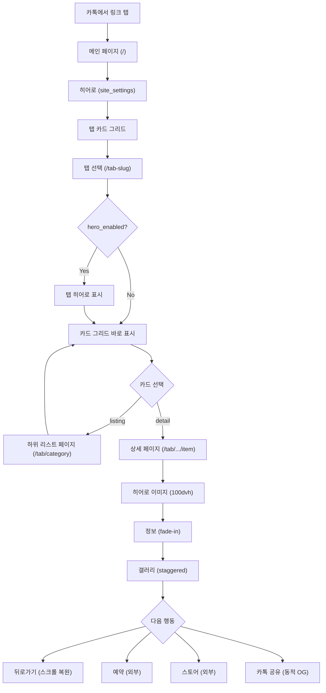
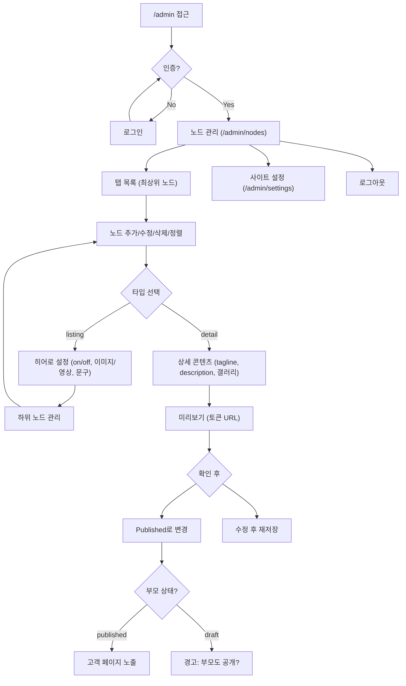
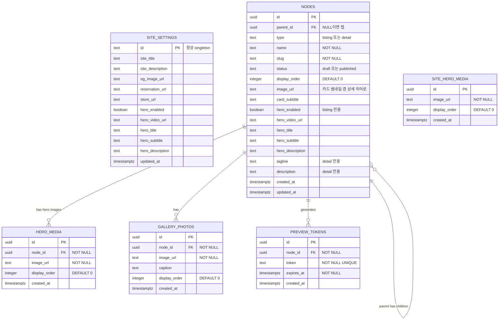

# 문장군 디지털 쇼룸 v2 — Product Requirements Document

## 1. Executive Summary (핵심 요약)

- **Vision Statement:** 개발자 없이, 사장님이 직접 구성·운영하는 프리미엄 디지털 쇼룸. 범용 노드 CMS로 어떤 제품 카테고리든 코드 수정 없이 추가·관리.
- **Problem Space:** v1은 컬러 전용 하드코딩 구조. 새 카테고리(디자인 등) 추가 시 개발자 필요. 메인 페이지·탭·카드 변경에 코드 수정 필요.
- **Target Persona & Context:**
  - **영업사원**: 카톡 링크 하나로 고객에게 쇼룸 전달
  - **고객**: 카톡 인앱 브라우저에서 컬러·디자인을 몰입감 있게 탐색, 가족에게 링크 공유
  - **관리자(사장님 1인)**: 어드민에서 탭 추가, 카테고리 구성, 아이템 관리를 직접 수행

## 2. Jobs-to-be-Done (사용자 과업 분석)

- **Functional Job:** 중문 필름의 컬러와 디자인을 고화질 이미지·시공 사례로 온라인에서 탐색하여 최종 결정한다. 관리자는 코드 수정 없이 새 제품 카테고리를 추가·운영한다.
- **Emotional Job:** "이 쇼룸 하나면 오프라인 컬러북 없이도 충분히 판단할 수 있다"는 확신. 관리자는 "개발자 없이 내가 직접 운영할 수 있다"는 자립감.
- **Social Job:** 마음에 드는 컬러/디자인 페이지 링크를 카톡으로 공유. 동적 OG로 미리보기 즉시 확인.

## 3. Architectural Constraints (불변의 제약 조건)

> ⚠️ AI 에이전트가 아키텍처를 결정할 때 절대 위배해서는 안 되는 Hard Hooks

### 3.1 Tech Stack
- Frontend: **Next.js (App Router)** — 설치 시점 최신 안정 버전
- Backend/DB: **Supabase** (PostgreSQL + Storage + Auth)
- Hosting: **Vercel**
- Language: **TypeScript** (strict mode)
- Style: **CSS Variables** (디자인 토큰 기반, TailwindCSS 미사용)
- Font: **Pretendard Variable** (CDN)
- Icon: **Lucide React**
- Animation: **Intersection Observer API** (Framer Motion 미사용 — 번들 최적화)
- Image Processing: **sharp** (dependencies에 배치 — 서버사이드 런타임 필요)
- DB Schema: **showroom** (v1의 `colorbook` 스키마에서 범용 CMS에 맞게 변경)

### 3.2 Security & RBAC
- 고객 페이지: 인증 없음 (공개)
- 어드민 (`/admin/*`): Supabase Auth (email/password), 단일 관리자 계정
- 관리자 회원가입 비활성화 — Supabase 대시보드에서 수동 생성
- Storage: 퍼블릭 읽기, 인증된 사용자만 업로드/삭제
- RLS 활성화: 고객은 published 노드만 조회
- **조상 체인 검증은 DB 레벨:** `is_node_visible(node_id)` PostgreSQL 함수로 조상 전체가 published인지 검증. RLS 정책에서 이 함수를 호출하여 API 직접 호출 시에도 draft 부모의 published 자식이 노출되지 않도록 보장.
- slug 체인 해석: `WITH RECURSIVE` CTE로 부모→자식 경로를 단일 쿼리로 해석

### 3.3 카카오톡 인앱 브라우저 호환 필수
- `100vh` 금지 → `100dvh` 사용
- Service Worker 의존 금지
- position: fixed 사용 시 키보드 이슈 고려
- `-webkit-` 접두사 CSS 속성 호환 확인

### 3.4 CRITICAL RULES
- `any` 타입 금지 — Supabase 자동 생성 타입 사용
- `console.log` 프로덕션 잔류 금지
- `console.error` 직접 호출 금지 → `src/lib/logger.ts`의 `logError()` 사용
- 컬러 하드코딩 금지 — `var(--color-*)` / `var(--admin-*)` 사용
- 간격: 4px 배수만 (`--space-N` 토큰)
- 인라인 스타일 금지 — CSS Modules 또는 체계적 스타일링
- 하드코딩된 콘텐츠 금지 — **모든 콘텐츠는 DB에서 동적 로딩**
- 이미지 URL 직접 `` 금지 — 반드시 `next/image` 사용
- 고객 컴포넌트에 어드민 로직 혼입 금지 — 완전 분리
- 고객 페이지 = 다크 토큰 / 어드민 = 라이트 토큰 (혼용 금지)

### 3.5 핵심 데이터 모델: 만능 노드 시스템

> v2의 가장 큰 변화. 모든 콘텐츠를 단일 `nodes` 테이블로 표현하는 트리 구조.

- **listing 노드** 🗂️ — 하위 카드를 보여주는 페이지 (선택적 히어로 + 카드 그리드)
- **detail 노드** ⛳ — 최종 도착지 (히어로 이미지 + 정보 + 갤러리 + CTA)
- **MVP 최대 깊이 4단계** (탭 → 카테고리 → 서브카테고리 → 아이템). 깊이 제한 해제는 v2.1+에서 검토.
- **detail 노드 = 히어로 영역 자동 Off** (리스트 히어로는 listing 전용)
- **detail 노드는 자식을 가질 수 없음** (엔드 포인트)
- URL 자동 생성: 부모 체인 slug 연결 (`/tab-slug/category-slug/item-slug`)

### 3.6 한글 Slug 규칙
- **기본: 관리자가 slug를 직접 입력** (어드민 폼에서 영문 소문자+하이픈으로 입력)
- 보조: name 입력 시 slug 필드에 자동 제안 (한글→로마자 transliteration, 관리자가 수정 가능)
- 중복 시 자동 넘버링 (`black`, `black-2`)
- 허용 문자: `[a-z0-9-]`

### 3.8 라우트 우선순위
- Next.js App Router에서 명시적 라우트(`/admin/*`, `/preview/*`)가 catch-all `[...slugs]`보다 우선
- 따라서 `admin`, `preview`를 탭 slug로 사용 금지 — 노드 생성 시 예약어 검증 필수
- 예약 slug 목록: `admin`, `preview`, `api`, `_next`

### 3.7 필수 환경 변수
```
NEXT_PUBLIC_SUPABASE_URL=
NEXT_PUBLIC_SUPABASE_ANON_KEY=
SUPABASE_SERVICE_ROLE_KEY=
NEXT_PUBLIC_SITE_URL=
```

## 4. Features & Execution Scope (실행 범위)

### 🟢 Must Have (핵심 비즈니스 로직 — MVP)

---

#### **[F-001] 메인 페이지 (고객)**

- **Context:** 카톡 링크 탭 시 처음 보는 화면. 사이트 히어로 + 탭(최상위 노드) 카드 그리드.
- **Machine-Verifiable Criteria:**
  - `Given` site_settings에 히어로가 활성화, published 탭 노드가 2개 이상 존재
  - `When` 고객이 메인 페이지(`/`)에 접속
  - `Then` 히어로 영역에 설정된 이미지(복수 시 자동 슬라이딩) 또는 영상(자동재생) + 문구가 표시됨
  - `Then` 히어로 아래에 published 탭 노드들이 카드 그리드로 display_order 순 표시
  - `Then` 각 카드에는 image_url + name + card_subtitle 표시
  - `Then` 카드 탭 시 해당 탭의 listing 페이지(`/[tab-slug]`)로 이동
  - `Then` draft 탭은 표시되지 않음
  - `Then` 모바일 2열 / 태블릿 3열 / 데스크탑 4열

---

#### **[F-002] 리스트 페이지 (고객 — 범용)**

- **Context:** 탭, 카테고리, 컬렉션 등 모든 listing 노드가 사용하는 공통 페이지.
- **Machine-Verifiable Criteria:**
  - `Given` slug 체인으로 식별된 listing 노드가 published이고 조상도 모두 published
  - `When` 고객이 해당 URL에 접속 (예: `/color`, `/design/sliding-door`)
  - `Then` hero_enabled이면 히어로 영역 표시 (이미지 복수 → 슬라이딩, 영상 → 자동재생, + 문구)
  - `Then` hero_enabled 아니면 히어로 영역 없이 바로 카드 그리드
  - `Then` 하위 published 노드들이 카드 그리드로 display_order 순 표시
  - `Then` published 자식이 0개인 listing 하위 노드는 카드에서 숨김
  - `Then` 카드 탭 시 하위 노드로 이동 (listing이면 리스트 페이지, detail이면 상세 페이지)
  - `Then` 뒤로가기 시 이전 스크롤 위치 복원
  - `When` draft 노드 또는 draft 조상의 URL로 직접 접속
  - `Then` 404 페이지 표시

---

#### **[F-003] 상세 페이지 (고객 — 범용)**

- **Context:** detail 노드의 최종 도착지. v1 컬러 상세와 동일한 검증된 레이아웃 재사용.
- **Machine-Verifiable Criteria:**
  - `Given` slug 체인으로 식별된 detail 노드가 published이고 조상도 모두 published, 갤러리 사진 존재
  - `When` 고객이 해당 URL에 접속 (예: `/color/original-color/black`)
  - `Then` 아래 섹션이 순서대로 렌더링:
    1. **히어로**: image_url이 뷰포트 100% 너비, `100dvh` 높이 (object-fit: cover)
    2. **정보**: 부모 노드명 태그 + name(h1) + tagline + description
    3. **갤러리**: gallery_photos가 display_order 순 나열, 뷰포트 진입 시 스크롤 애니메이션
    4. **CTA 바**: 무료방문실측 예약 + 브랜드스토어 링크
  - `Then` "전체 보기" 버튼으로 부모 리스트 페이지 복귀 가능
  - `When` draft 노드 URL로 직접 접속 → 404

---

#### **[F-004] 스크롤 애니메이션 (고객)**

- **Context:** v1과 동일. 정적 이미지 나열과 차별화되는 프리미엄 경험.
- **Machine-Verifiable Criteria:**
  - `Given` 상세 페이지에 갤러리 사진이 1장 이상
  - `When` 사용자가 갤러리로 스크롤
  - `Then` 각 사진이 뷰포트 진입 시 fade-in + slide-up staggered 애니메이션
  - `Then` 정보 텍스트도 fade-in
  - `Then` `prefers-reduced-motion: reduce` 시 비활성화
  - `Then` Intersection Observer API로 구현

---

#### **[F-005] 어드민 인증**

- **Context:** v1과 동일. 1인 관리자 전용 보호.
- **Machine-Verifiable Criteria:**
  - `Given` 관리자 계정이 Supabase Auth에 등록
  - `When` 비인증 사용자가 `/admin` 접근 → 로그인 페이지 리다이렉트
  - `When` 올바른 자격 증명으로 로그인 → 노드 관리 페이지로 이동
  - `When` 잘못된 자격 증명 → 에러 메시지
  - `Then` 회원가입 페이지/링크 없음
  - `When` 로그아웃 클릭 → 세션 무효화 후 로그인 페이지

---

#### **[F-006] 노드 관리 (어드민 — 핵심)**

- **Context:** v2의 핵심. 만능 노드 트리를 어드민에서 자유롭게 CRUD.
- **Machine-Verifiable Criteria:**
  - `Given` 관리자 로그인 상태
  - `When` `/admin/nodes`에 접근
  - `Then` 최상위 탭 노드들이 display_order 순 리스트 (상태 뱃지 + 하위 노드 수)
  - `When` 탭 노드 클릭 → 해당 노드의 편집 + 하위 노드 관리 화면
  - `When` "노드 추가" 클릭
  - `Then` 폼 표시: name(필수), slug(자동생성/수동편집), type(listing/detail), image_url
  - `When` type을 `listing`으로 설정
  - `Then` 히어로 설정 영역 표시: hero_enabled 토글, hero_images(복수 업로드), hero_video_url, hero_title/subtitle/description
  - `When` type을 `detail`로 변경
  - `Then` hero_enabled 자동 Off, 히어로 설정 영역 숨김
  - `Then` 대신 상세 콘텐츠 영역 표시: tagline, description, 갤러리 사진 관리
  - `When` listing 노드에 자식이 있는 상태에서 detail로 변경 시도
  - `Then` "하위 N개 항목이 있어 상세 타입으로 변경할 수 없습니다" 에러
  - `When` 드래그앤드롭으로 노드 순서 변경 → display_order 업데이트
  - `When` 노드 "삭제" 클릭
  - `Then` 확인 모달("하위 N개 항목과 M개 이미지도 삭제됩니다") → 승인 시 Storage 파일 + DB cascade 삭제
  - `Then` listing 노드의 published 자식이 0개이면 "고객 미노출(자식 없음)" 워닝 뱃지 표시

---

#### **[F-007] 이미지 업로드 & 자동 압축**

- **Context:** v1 강화. 업로드 시 자동 압축으로 운영 편의성 극대화.
- **Machine-Verifiable Criteria:**
  - `Given` 관리자가 이미지를 업로드
  - `When` 10MB 이하 JPG/PNG/WebP 선택 → 프로그레스 바 + Storage 저장 + 미리보기 표시
  - `When` 10MB 초과 → "10MB 이하만 업로드 가능" 에러, 차단
  - `When` 지원 외 형식 → "JPG, PNG, WebP만 지원" 에러, 차단
  - `Then` 노드 이미지: 1600px/80% 압축 (텍스처 품질 유지)
  - `Then` 갤러리 사진: 1000px/70% 압축 (로딩 최적화)
  - `Then` 고객 페이지에서 `next/image`로 렌더링 시 WebP/AVIF 자동 변환

---

#### **[F-008] 초안/미리보기/공개 워크플로우**

- **Context:** v1과 동일 원리. 노드 단위로 draft/published 관리 + 토큰 기반 미리보기.
- **Machine-Verifiable Criteria:**
  - `Given` 새 노드 생성 → `draft` 상태
  - `When` "미리보기" 클릭 → 토큰 URL(`/preview/[token]`)로 새 탭 열림
  - `Then` 토큰 기본 만료 시간: **72시간**
  - `Then` 비로그인자도 토큰 유효 시 열람 가능, 상단에 "미리보기 모드" 배너
  - `When` published로 변경 + 저장 → 고객 페이지에 표시
  - `When` published → draft 변경 → 고객 페이지에서 즉시 비표시
  - **계층 상태 규칙:**
    - 조상 노드가 draft이면, 하위 모든 노드는 고객 페이지에 비표시
    - published 변경 시 부모가 draft이면 경고: "상위 노드가 비공개입니다. 함께 공개하시겠습니까?"

---

#### **[F-009] OG 메타 태그 (모든 페이지 동적)**

- **Context:** 카톡 공유 시 모든 단계에서 해당 노드의 이미지·제목·설명으로 미리보기 표시.
- **Machine-Verifiable Criteria:**
  - `Given` 메인 페이지 → site_settings의 og_image_url, site_title, site_description
  - `Given` 노드 페이지 → 해당 노드의 image_url, name, tagline/description
  - `Then` `og:title`, `og:description`, `og:image`, `og:url` 동적 생성
  - `Then` Next.js `generateMetadata` 함수로 구현

---

#### **[F-010] CTA 액션**

- **Context:** v1과 동일. 고객이 바로 다음 행동으로 이어지도록.
- **Machine-Verifiable Criteria:**
  - `Given` site_settings에 reservation_url, store_url 설정
  - `Then` 상세 페이지 + 메인 페이지 하단에 sticky CTA 바
  - `Then` 히어로에서는 숨김, 스크롤 다운 시 표시

---

#### **[F-011] 사이트 설정 (어드민)**

- **Context:** 메인 페이지 히어로 + 전역 설정을 어드민에서 관리.
- **Machine-Verifiable Criteria:**
  - `Given` 관리자가 `/admin/settings`에 접근
  - `Then` 편집 가능: 사이트 제목, 설명, OG 이미지, 예약 URL, 스토어 URL
  - `Then` 메인 히어로 설정: on/off 토글, 이미지(복수)/영상, 상단·메인·하단 문구
  - `When` 저장 → site_settings UPSERT + 성공 토스트

---

#### **[F-012] v1 → v2 데이터 마이그레이션**

- **Context:** 기존 컬러 데이터를 새 노드 구조로 이관. Storage 이미지 파일은 유지.
- **Machine-Verifiable Criteria:**
  - `Given` v1 collections, colors, installation_photos 데이터 존재
  - `When` 마이그레이션 스크립트 실행
  - `Then` "컬러" 탭 노드 생성 (listing, parent_id=NULL)
  - `Then` 각 collection → listing 노드 (parent=컬러 탭)
  - `Then` 각 color → detail 노드 (parent=해당 collection 노드), image_url=texture_image_url
  - `Then` 각 installation_photo → gallery_photos (node_id=해당 color 노드)
  - `Then` site_settings 히어로 필드 추가
  - **마이그레이션 안전장치 (3단계):**
    1. 기존 테이블을 `_backup_*`로 복사 (데이터 보존)
    2. 새 테이블에 데이터 이관 + 검증 (전체 노드 수 일치, 이미지 URL 접근 확인)
    3. 검증 통과 후 백업 테이블 DROP (실패 시 롤백)
  - **v1 URL 301 리다이렉트:** `next.config.ts`에 리다이렉트 맵 추가
    - `/color/:collectionSlug/:colorSlug` → `/:tabSlug/:collectionSlug/:colorSlug`
    - 기존 카톡 공유 링크가 새 URL로 자동 전환
  - `Then` 모든 이미지 URL 정상 작동 확인

---

#### **[F-013] 이미지 라이트박스 (v1 코드 재사용)**

- **Context:** v1에서 이미 구현·배포된 ImageLightbox. v2에서 제외하면 기능 퇴행.
- **Machine-Verifiable Criteria:**
  - `Given` 상세 페이지 갤러리에 사진이 1장 이상
  - `When` 사진 탭
  - `Then` 풀스크린 라이트박스 열림 (v1 ImageLightbox 컴포넌트 재사용)
  - `Then` 좌우 화살표 / 스와이프로 이전/다음 사진
  - `Then` 슬라이드 애니메이션 + 프리로드
  - `Then` 배경 또는 X 버튼으로 닫기

---

### 🟡 Should Have (v2.1+ 후속 릴리즈)

- **[F-101] 카드 템플릿 시스템** — 카드 레이아웃/사이즈/디자인을 템플릿으로 선택 (v2.1)
- **[F-102] 상세 페이지 섹션 빌더** — 상세 페이지의 섹션을 자유롭게 조합 (v2.2+)
- **[F-103] 이전/다음 네비게이션** — 같은 부모 내 이전/다음 노드 이동 (v2.1)
- **[F-104] 방문자 통계** — 노드별 page view 카운터 (v2.1)
- **[F-105] 디자인 커스터마이징** — 어드민에서 브랜드 컬러·배경·폰트 등을 변경하면 고객 페이지에 즉시 반영 (v2.2)
  - 구현 원리: `site_settings.design_overrides` JSONB 컬럼에 CSS 변수 오버라이드 값 저장
  - 고객 페이지 로드 시 DB에서 읽어 `:root` CSS 변수를 동적 주입
  - 최소 범위: 악센트 컬러, 배경색, 카드 배경색 (5~6개 토큰)
  - 어드민 UI: 컬러 피커 + 실시간 미리보기 + 저장

### 🔴 Explicitly Out-of-Scope (절대 구현 금지 사항)

> ⛔ 에이전트의 스코프 크립 방지. 아래 기능은 어떤 상황에서도 구현하지 않는다.

- **[X-001]** 결제/장바구니: 쇼케이스 전용. 구매는 스마트스토어에서 별도.
- **[X-002]** 고객 회원가입/로그인: 고객은 인증 없이 자유 탐색. 어떤 고객 계정 시스템도 금지.
- **[X-003]** 댓글/리뷰/문의: 고객 소통은 카톡/전화로. 사이트 내 커뮤니케이션 금지.
- **[X-004]** 다국어(i18n): 한국어 단일. 번역 시스템 금지.
- **[X-005]** 검색/필터: 초기 규모에서 불필요. 검색바, 필터 드롭다운 금지.
- **[X-006]** 알림 시스템: 이메일/푸시/SMS 일체 금지.
- **[X-007]** AR/VR 미리보기: 3D 뷰어, 카메라 시뮬레이션 금지.
- **[X-008]** 카드 템플릿 시스템: v2.1로 이관. MVP에서는 v1 카드 디자인 고정.
- **[X-009]** 섹션 빌더/비주얼 에디터: v2.2+로 이관. MVP에서는 고정 레이아웃.

## 5. Topological Context (구조 및 위상 흐름)

### 5.1 고객 User Flow



### 5.2 어드민 User Flow



### 5.3 Data Entity Relationship



**DB 제약 조건 (마이그레이션 필수):**
- `NODES.type`: CHECK `(type IN ('listing', 'detail'))`
- `NODES.status`: CHECK `(status IN ('draft', 'published'))`
- `NODES.parent_id`: ON DELETE CASCADE
- 탭 slug 유일: `UNIQUE(slug) WHERE parent_id IS NULL` (partial index)
- 형제 slug 유일: `UNIQUE(parent_id, slug) WHERE parent_id IS NOT NULL` (partial index)
- `SITE_SETTINGS`: CHECK `(id = 'singleton')`
- `HERO_MEDIA.node_id`: ON DELETE CASCADE
- `GALLERY_PHOTOS.node_id`: ON DELETE CASCADE
- `PREVIEW_TOKENS.node_id`: ON DELETE CASCADE
- `SITE_HERO_MEDIA`: site_settings 전용 히어로 이미지 (ON DELETE CASCADE 불필요, 수동 관리)
- 인덱스: `(parent_id, display_order)`, `(parent_id, status)`
- **노드 최대 깊이 4 제한:** 앱 레벨에서 INSERT 시 조상 체인 길이 검증

### 5.4 디렉토리 구조 (권장)

```
munjanggun/
├── src/
│   ├── app/
│   │   ├── layout.tsx                 # 루트 레이아웃
│   │   ├── page.tsx                   # 메인 페이지 (히어로 + 탭 그리드)
│   │   ├── [...slugs]/
│   │   │   └── page.tsx               # 범용 catch-all (listing or detail)
│   │   ├── preview/
│   │   │   └── [token]/
│   │   │       └── page.tsx           # 토큰 미리보기
│   │   ├── admin/
│   │   │   ├── layout.tsx             # 어드민 auth guard
│   │   │   ├── login/page.tsx
│   │   │   ├── nodes/
│   │   │   │   ├── page.tsx           # 탭 목록 (루트 노드)
│   │   │   │   └── [id]/
│   │   │   │       └── page.tsx       # 노드 편집 + 자식 관리
│   │   │   └── settings/page.tsx
│   │   ├── not-found.tsx
│   │   └── globals.css
│   ├── components/
│   │   ├── customer/
│   │   │   ├── HeroSection.tsx        # 범용 히어로 (이미지 슬라이더/영상 + 문구)
│   │   │   ├── CardGrid.tsx           # 범용 카드 그리드
│   │   │   ├── NodeCard.tsx           # 범용 카드
│   │   │   ├── DetailHero.tsx         # 상세 풀스크린 히어로
│   │   │   ├── DetailContent.tsx      # 상세 정보 섹션
│   │   │   ├── GallerySection.tsx     # 갤러리
│   │   │   ├── CTABar.tsx
│   │   │   └── ScrollAnimationWrapper.tsx
│   │   └── admin/
│   │       ├── AdminSidebar.tsx
│   │       ├── NodeForm.tsx           # 범용 노드 편집기
│   │       ├── NodeList.tsx           # 노드 리스트 + 정렬
│   │       ├── HeroConfigurator.tsx   # 히어로 설정 UI
│   │       ├── ImageUploader.tsx
│   │       ├── GalleryManager.tsx
│   │       ├── DragDropList.tsx
│   │       └── StatusBadge.tsx
│   ├── lib/
│   │   ├── supabase/
│   │   │   ├── client.ts
│   │   │   ├── server.ts
│   │   │   └── admin.ts
│   │   ├── nodes.ts                   # 노드 해석 (slug→노드, 조상 검증, URL 빌드)
│   │   ├── image-compression.ts       # 서버사이드 이미지 압축
│   │   ├── logger.ts
│   │   ├── utils.ts
│   │   └── constants.ts
│   └── types/
│       └── database.ts
├── scripts/
│   └── migrate-v1-to-v2.ts           # 데이터 마이그레이션
├── public/
├── docs/showroom/PRD_v2.0.md                    # 이 문서 (프로젝트 루트)
├── docs/
│   ├── PROJECT_BRIEF_v2.md
│   └── DESIGN_SYSTEM.md
├── next.config.ts
├── package.json
└── tsconfig.json
```

## 6. AI Evals & Quality Gates

- [ ] **EVAL-01:** `npm run build` 에러·워닝 없이 완료
- [ ] **EVAL-02:** 메인 → 탭 → 카테고리 → 상세 → CTA → 뒤로가기(스크롤 복원) 전체 플로우 정상
- [ ] **EVAL-03:** 어드민: 탭 추가 → listing 노드 추가(히어로 on) → detail 노드 추가(갤러리 포함) → 미리보기 → 공개 플로우 정상
- [ ] **EVAL-04:** detail 노드 지정 시 hero_enabled 자동 Off 확인
- [ ] **EVAL-05:** detail 노드에 자식 추가 시도 → 차단 확인
- [ ] **EVAL-06:** Out-of-Scope 기능 미구현 확인
- [ ] **EVAL-07:** 모바일(375px) 메인/리스트/상세 정상 렌더링
- [ ] **EVAL-08:** draft 노드가 고객 페이지에 비표시 + draft 부모의 published 자식도 비표시
- [ ] **EVAL-09:** RLS: 비인증 사용자가 draft 데이터 API 조회 불가
- [ ] **EVAL-10:** 모든 이미지가 `next/image` + Lazy Loading
- [ ] **EVAL-11:** `prefers-reduced-motion: reduce` 시 애니메이션 비활성화
- [ ] **EVAL-12:** `/admin` 비인증 접근 → 로그인 리다이렉트
- [ ] **EVAL-13:** 모든 페이지의 OG 태그가 해당 노드 정보로 동적 생성
- [ ] **EVAL-14:** `100dvh` 사용, 카카오톡 인앱 호환
- [ ] **EVAL-15:** 10MB 초과 이미지 업로드 차단
- [ ] **EVAL-16:** v1 데이터 마이그레이션 후 모든 기존 콘텐츠 정상 표시
- [ ] **EVAL-17:** catch-all 라우트 `/[...slugs]`가 모든 깊이(최대 4)에서 정상 작동
- [ ] **EVAL-18:** v1 URL(`/color/...`)이 301 리다이렉트로 새 URL에 정상 도달
- [ ] **EVAL-19:** 카카오톡 인앱 브라우저에서 영상 히어로 자동재생 정상 작동 (실패 시 정지 이미지 fallback)
- [ ] **EVAL-20:** 라이트박스가 갤러리 사진에서 정상 작동 (열기/닫기/스와이프)
- [ ] **EVAL-21:** 예약 slug(`admin`, `preview`, `api`, `_next`)로 탭 생성 시도 → 차단

## 7. Implementation Phases

> WISC 격리 원칙: 각 Phase는 독립적인 에이전트 세션으로 실행 가능.

### Phase 0: 기반 설정
- [ ] v1 코드베이스에서 git branch 생성 (`v2-cms`)
- [ ] 불필요한 v1 전용 코드 정리 (하드코딩 라우트, 컬러 전용 컴포넌트)
- [ ] 디렉토리 구조 재구성 (5.4 참조)
- [ ] next.config.ts 업데이트

### Phase 1: 데이터베이스 & 인증
- [ ] 새 Supabase 스키마(`showroom`): nodes, hero_media, site_hero_media, gallery_photos, preview_tokens, site_settings
- [ ] `is_node_visible(node_id)` PostgreSQL 함수 (WITH RECURSIVE CTE로 조상 published 검증)
- [ ] 제약 조건 + 인덱스 (5.3 참조)
- [ ] RLS 정책: anon=`is_node_visible()` 통과만, authenticated=전체
- [ ] Storage 버킷 유지 (`images`)
- [ ] TypeScript 타입 재생성
- [ ] v1→v2 마이그레이션 스크립트 작성 + 실행 [F-012]

### Phase 2: 어드민 CMS
- [ ] 어드민 레이아웃 + auth guard [F-005]
- [ ] `/admin` → `/admin/nodes` 리다이렉트
- [ ] 노드 관리: CRUD + 타입 전환 + 드래그앤드롭 [F-006]
- [ ] 히어로 설정 UI (이미지 복수/영상 + 문구) [F-006]
- [ ] 이미지 업로더 + 자동 압축 [F-007]
- [ ] 갤러리 관리 (복수 업로드 + 정렬) [F-006]
- [ ] 미리보기 워크플로우 [F-008]
- [ ] 사이트 설정 페이지 [F-011]

### Phase 3: 고객 페이지
- [ ] 메인 페이지 (히어로 + 탭 그리드) [F-001]
- [ ] catch-all `[...slugs]` 라우트 + 노드 해석 로직 [F-002, F-003]
- [ ] 범용 리스트 페이지 (선택적 히어로 + 카드 그리드) [F-002]
- [ ] 범용 상세 페이지 (히어로 + 정보 + 갤러리 + CTA) [F-003]
- [ ] 스크롤 애니메이션 [F-004]
- [ ] 라이트박스 [F-013] (v1 ImageLightbox 재사용)
- [ ] CTA 바 [F-010]
- [ ] 동적 OG 메타 태그 [F-009]
- [ ] 토큰 미리보기 페이지
- [ ] 모바일 퍼스트 반응형

### Phase 4: 검증 & 폴리싱
- [ ] EVAL-01 ~ EVAL-21 전수 검사
- [ ] v1 URL 리다이렉트 테스트 (next.config.ts)
- [ ] 카카오톡 인앱 브라우저 호환 테스트
- [ ] 이미지 로딩 성능 확인
- [ ] 에러 핸들링 (네트워크 실패, 이미지 로드 실패 fallback UI)
- [ ] 접근성 기본 확인 (alt 텍스트, 키보드 네비게이션)
- [ ] 최종 빌드 → Vercel 배포

---

## Appendix: Graceful Degradation

| 실패 상황 | 대응 전략 |
|-----------|-----------|
| Supabase DB 연결 실패 | Error Boundary로 친화적 에러 UI 표시 |
| 이미지 로드 실패 | `next/image` onError → 플레이스홀더 (컬러 배경 + 노드명 텍스트) |
| 어드민 이미지 업로드 실패 | 실패 토스트 + 재시도. 업로드 중 이탈 경고 |
| 모든 탭이 draft | 고객 페이지에 "준비 중입니다. 곧 만나보세요!" 안내 |
| slug 중복 | 자동 넘버링 서픽스 (`black`, `black-2`) |
| 미리보기 토큰 만료 | "기간 만료. 관리자에게 새 링크 요청" 안내 |
| Storage 파일 삭제 실패 | DB 삭제는 진행, 실패 파일 경로 로그 기록 |
| slug 체인 해석 실패 (중간 노드 없음) | 404 페이지 |
| detail 노드에 자식 추가 시도 | 앱 레벨에서 차단 + 에러 메시지 |
| 마이그레이션 중 데이터 불일치 | 트랜잭션 롤백 + 에러 로그, 수동 확인 후 재실행 |

